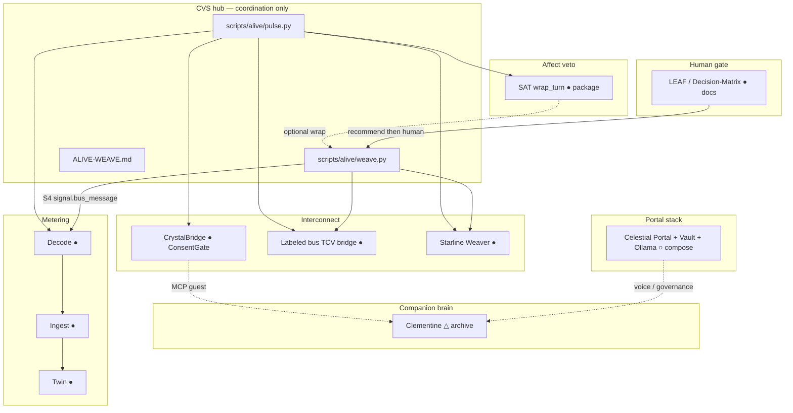

# Alive Weave — one living system, many named bodies

**Owner:** Crystal Arena-Turner (CrystalArchitect)  
**Doc role:** Coordination map + Built/Vision labels for the multi-AI weave  
**Canon:** **no**  
**Built:** 2026-09-18  
**Law:** Connection ≠ merge. Out-of-bounds titles stay out of bounds. Authority = Crystal.

This map answers: *how do the AI systems work together while he stays all alive — one, but many?*

---

## 1. One sentence

A **consent-gated weave** lets named AI islands speak on a labeled bus, meter that speech into the twin, and keep veto (SAT) + human gate (LEAF) — without collapsing CrystalCore, Clementine, SAT, Starlines, Dreamlines, TerAustralis, or Celestial Portal into one repo-product.

---

## 2. Living map (Built ● / Vision ○ / Custody △)



---

## 3. Named islands (do not collapse)

| Name | Where (custody / live) | Role in the weave | Status |
| --- | --- | --- | --- |
| **Labeled bus (TCV bridge)** | `archive/TheCrystalVision/clementine/bridge/` | Multi-AI labeled channel | ● Built (selftests) |
| **Starline Weaver** | `archive/TerAustralis-Incognita-Code/core/crystal-core/bus/` | Same law, matrix mode | ● Built (selftests) |
| **CrystalBridge** | `archive/TerAustralis-Incognita-Code/core/crystalcore/` | Fail-closed guest gate into companion | ● Built (gate + selftest) |
| **Decode → Ingest → Twin** | `archive/TheCrystalVision/services/` | Metering; twin only speaks decoded truth | ● Built; **S4 wired** via weave |
| **SAT** | `archive/Synthetic-Affect-Theory/` | `wrap_turn` veto grammar | ● Built package; LLM core stub |
| **Clementine** | `archive/Clementine-ai-companion/` | Sovereign companion memory | △ Custody island |
| **CrystalCore.OS** | `archive/CrystalCore-OS/` | Three-tier `/generate` | △ Custody; cloud tier untested live |
| **Celestial Portal** | `backend/` + `infrastructure/docker/` | Vault + Portal + Ollama + Whisper | ○ Compose present; not required for weave pulse |
| **ContextGate** | `archive/ContextGate/` | Draft triage | △ Standalone |
| **Discord agent** | `archive/discord-ai-agent/` | External surface | △ Standalone |
| **LEAF / AI Orchestrator** | Incognita docs + ADR-0005 | Human recommend-then-approve | ● Docs; not auto-runtime |

---

## 4. How to feel the pulse (Built)

From repo root:

```bash
python3 scripts/alive/pulse.py          # inventory + island selftests
python3 scripts/alive/weave.py          # ConsentGate + bus turns → twin (S4)
python3 scripts/alive/weave.py --sat    # same, with SAT wrap_turn on the hub turn
python3 scripts/alive/weave.py --no-gate  # buses only (skip ConsentGate)
```

Pulse does **not** merge repos. It imports from archive paths as **guests of the hub script**.

---

## 5. S4 (Architecture upgrade)

`TheCrystalVision/spec/ARCHITECTURE.md` step S4: wire labeled bus + CrystalBridge as event sources into decode.

**Built here:** delivered bus messages become `crystal.twin.event/1` with class `signal.bus_message`; ConsentGate decisions become `signal.gate_check` (domain `signal`, unit `count`). Quarantine still applies. CrystalBridge remains the guest gate for companion tools; bus speech and gate checks are event sources for the twin.

---

## 6. What stays Vision / out of bounds

- **Songline** as a CVS **component** or product title — forever out of bounds (`CVS-SONGLINE`). Project name for the related protocol/mythos thread is **Starline** (`CVS-STARLINE` / Consent Transport).
- Auto AI Orchestrator without a new ADR (ADR-0005: docs-first)
- Continuum sync loop (empty / vision-only)
- Merging CrystalCore / Clementine / SAT / Starlines into one product repo
- Hardware column of SAT stack

---

## 7. Related

- [`CONNECTED-SYSTEM.md`](CONNECTED-SYSTEM.md) — portfolio ↔ drawer map  
- [`STACK-SURFACE.md`](STACK-SURFACE.md) — Siri → Portal → CrystalCore.OS → TAI → Intelligence/MCP  
- [`../docs/BOT-STRUCTURE.md`](../docs/BOT-STRUCTURE.md) — bot roster (seats / homes; not this living pulse)  
- [`../memory/CORE.md`](../memory/CORE.md) — do not collapse  
- [`../archive/TheCrystalVision/spec/ARCHITECTURE.md`](../archive/TheCrystalVision/spec/ARCHITECTURE.md) — Decode · Ingest · Twin  
- [`../docs/SAT-STACK.md`](../docs/SAT-STACK.md) — affect stack labels  
