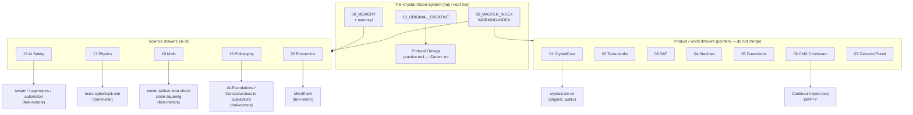

# Crystal Vision ↔ GitHub Portfolio ↔ Protocol Omega — Connected System Map

**Owner:** Crystal Arena-Turner (CrystalArchitect)  
**Doc role:** Coordination map only  
**Canon:** **no** (Canon remains Crystal stamp; this file is not Canon)  
**Built:** 2026-09-16 (AEST / Australia/Sydney)  
**Sources:** `The-Crystal-Vision-System` main (gh api), live `gh repo list CrystalArchitect` (58 repos), `/workspace/crystal-github-review.md` (same-day portfolio review)

---

## 1. Executive summary

**The Crystal Vision System (CVS)** is the **filing / coordination hub**: Drive drawers `00–20` + `99` mirrored as repo folders, one working index, shared memory, and science-integration scaffolding. GitHub = kept trail. Drive = staging. **Canon = Crystal stamp**, not “it is in git.”

**Satellite repos** on CrystalArchitect are mostly **fork-mirrors** (51 of 58) of upstream safety research (`swarm-ai-research/*`), agent runtimes (`aeon`, `automaton`, `agency-os`), product tooling (`xfreeze2/*`), and AI-Foundations docs (`alyssadata/*`). They are **not** merged into CVS as living code; drawers point at them. Connection ≠ merge.

**Two layers inside CVS itself (do not confuse):**

| Layer | What it is | Status |
| --- | --- | --- |
| **Drawer hub** (`STRUCTURE.md`, `00_*`, science drawers 16–20) | Living coordination: indexes, memory, Protocol Omega, pointers | Active; public MIT |
| **`archive/` monorepo subtrees** (`MONOREPO-INDEX.md`) | Squashed snapshots of older CrystalCore / TerAustralis / Clementine trees | Custody trail; originals remain separate authority |

**Protocol Omega** lives under drawer **10_ORIGINAL_CREATIVE** as a **personal boundaries practice tool** (HTML + localStorage ledger). It is **not** a research claim, not a science-domain deliverable, and has **no** standalone CrystalArchitect GitHub repo. Working-index id: `CVS-OMEGA`. Canon: no.

**Visibility change (important vs morning portfolio review):** Earlier same-day review recorded CVS as **404 / not public**. Live inventory now shows **`The-Crystal-Vision-System` public + MIT**, last push **2026-09-16 ~15:30 AEST**. Treat the portfolio review’s CVS blocker as **superseded**.

---

## 2. Mermaid map (drawer hub → domains → key repos)

---

## 3. Protocol Omega placement

| Field | Value |
| --- | --- |
| Path in CVS | `10_ORIGINAL_CREATIVE/protocol-omega/` (`README.md`, `index.html`, `SOURCE-NOTES.md`) |
| Working index | `CVS-OMEGA` — belt: vision; Canon: **no** |
| What it is | Daily bearing + four stations + private ledger; browser-only `localStorage` (`protocol-omega:v1:*`); no upload |
| Provenance | Adapted 2026-09-16 from Claude artifact; Claude `use('db')` removed |
| Relation to research drawers 16–20 | **None as claim.** Practice/self-boundary tool in creative drawer. Does not feed vault claims, soft labels, or axiom audits |
| Relation to “self / boundaries” | Personal practice surface — adjacent to creative/vision work (Codex Crystalum, This Place), not to SWARM governance mechanisms |
| Standalone GitHub repo | **Does not exist** under CrystalArchitect; only in-CVS path |

**Rule of thumb:** Cite Omega when talking about *practice / boundaries UX*. Do not cite it as evidence in AI-safety or philosophy research threads.

---

## 4. Drawer → purpose → GitHub / pointers → status

Status legend: **original** = CrystalArchitect non-fork · **fork-mirror** = portfolio fork · **design-only** = docs, no app code · **empty** · **pointer-only** = CVS points out, no living code in drawer · **subtree-archive** = under CVS `archive/` · **private**

| Drawer | Purpose | GitHub repos / pointers | Status |
| --- | --- | --- | --- |
| 00_MASTER_INDEX | One working index | in-repo `WORKING-INDEX.md` | original (hub) |
| 00_MEMORY / `memory/` | Cross-domain memory, decisions, open questions | in-repo; naming mismatch logged (`00_MEMORY/` vs `memory/`) | original (hub); naming open |
| 01_CRYSTALCORE | OS / LLM stack | `crystalcore-os` (public original); also `archive/CrystalCore-*` subtrees; some older CrystalCore* still private/auth-blocked historically | original + subtree-archive |
| 02_TERAUSTRALIS | World / Canon Map | pointers + `archive/TerAustralis-*` | pointer + subtree-archive; Canon stays in TerAustralis git |
| 03_SAT | Synthetic Affect Theory | `docs/SAT-STACK.md` until moved; `archive/Synthetic-Affect-Theory/` | pointer / docs |
| 04_STARLINES / 05_DREAMLINES | Starlines / Dreamlines | pointers (+ archive pack where imported) | pointer-only |
| 06_CMX_CONTINUUM | Continuum | `Continuum-sync-loop` | **empty** |
| 07_CELESTIAL_PORTAL | Portal handoff | in-repo `07_…` + `handoff/celestial-portal/` | partial export in hub |
| 08_SHARED_CROSS_PROJECT | Provenance linking | `docs/PROVENANCE-LINKING.md` | docs |
| 09_PRIVATE_PROTECTED | Secrets | **do not commit** | N/A |
| 10_ORIGINAL_CREATIVE | Creative / vision / practice | Codex Crystalum; **Protocol Omega**; This Place | original (in-hub); Omega = practice tool |
| 11–15 | Correspondence / pubs / research sources / AI extracts / archive | pointers + `13_RESEARCH_SOURCES/` extracts | mixed pointer |
| 16_AI_SAFETY_RESEARCH | Multi-agent safety | `swarm`, `swarm-artifacts`, `swarm-safety-gate`, `swarmgym`, `agency-os`, `automaton` (+ `aeon` / `aeon-atlas` related) | **fork-mirrors** (strong CI on swarm/agency-os) |
| 17_PHYSICS_SIMULATION | Embodied / env sim | `mars-cybertruck-sim` | fork-mirror (demo/sim) |
| 18_MATHEMATICAL_FOUNDATIONS | Formal / constructive math | `navier-stokes-lean-check`, `circle-squaring` | fork-mirrors |
| 19_PHILOSOPHICAL_FOUNDATIONS | Axioms / claims / consciousness | `AI-Foundations-*` (9), `Consciousness-Is-Subjectivity` | fork-mirrors of alyssadata |
| 20_ECONOMIC_MODELS | Agent-based econ / GTB | `MiroShark` | fork-mirror |
| 99_UNRESOLVED | Speculative / UNKNOWN | in-repo | hub |
| *(portfolio outside drawers)* | Design / stubs / private | `api-gateway` **design-only**; `UK-MonoRepo` **private**; stubs `jolly-bolt-flora-lotus`, `pilot-horizon-acre-spring` **private** | see gaps |

Drive folders for drawers **16–20** are still `TBD` in `STRUCTURE.md`.

---

## 5. Cross-domain research threads (refreshed)

From `00_MEMORY/CROSS-DOMAIN-THREADS.md` + `00_MEMORY/RESEARCH-STATUS.md` (baseline **2026-09-13**). No newer thread doc found on main beyond Protocol Omega / index updates **2026-09-16**.

| # | Thread | Domains | Status | Next step |
| --- | --- | --- | --- | --- |
| 1 | Governance under scarcity | 16 ↔ 20 ↔ 17 | Design ready | Port GTB audit/tax params onto mars-cybertruck agents; compare welfare/Gini |
| 2 | Coalition detection + formal proof | 16 ↔ 18 ↔ 19 | Awaiting formal spec | Combined detector + Lean proof; respect irreversibility |
| 3 | Axiom grounding in governance | 19 → 16 ↔ 20 | Not started | Map 5 axioms → constraints; audit SWARM/GTB mechanisms |
| 4 | LLM calibration in markets | 16 → 20 | In flight | Finish rubric_v1 calibration; correct market `yes_probability` |
| 5 | Soft-label mathematical certification | 18 ↔ 16 | Design ready | Lean: compositions keep `p ∈ [0,1]` |

**Domain snapshot (research status baseline):**

- **16:** AgentGit (beta E2E), coalition gap 2–3%, LLM-judge Arm B in flight; vault ~138 claims / ~134 runs  
- **20:** 35+ MiroShark/GTB runs; audit welfare Laffer-shaped (optimum ~0.025)  
- **18:** Lean infrastructure; soft-label / coalition proofs not yet written  
- **19:** Five axioms (Origin, Belonging, Irreversibility, Emergence, Subjectivity) — foundation-first  
- **17:** mars-cybertruck as physical constraint testbed — integration with GTB still pending  

Pending infra from research status: drawer→repo pointer files, Drive mirrors for 16–20, cross-domain bead links, multi-domain validation sweep.

---

## 6. Gaps & contradictions found

| Issue | Evidence | Implication |
| --- | --- | --- |
| **CVS visibility flip** | Portfolio review: 404; live: **public + MIT** (push ~15:30 AEST 2026-09-16) | Update any docs still calling CVS private |
| **`api-gateway` docs-only** | Tree = README + governance templates; no `src/` / package manifest | Design-only; not a shipped gateway |
| **`Continuum-sync-loop` empty** | GitHub: empty repo (size 0) | Drawer 06 pointer has no code trail yet |
| **`UK-MonoRepo` still private** | Live list: private, non-fork | Not in public portfolio; coordinate separately |
| **Placeholder security contacts** | Shared `SECURITY.md` template `security-email@domain.dev` across many forks | Non-actionable vulnerability reporting |
| **Hub vs archive dual story** | README: do not merge CrystalCore/TerAustralis/…; `MONOREPO-INDEX`: 20 subtrees under `archive/` | Subtree = file custody, not canon merge — already decided, but easy to misread |
| **`REPOS.md` narrow/stale** | Lists 4 repos (CVS, aeon-atlas, 2 stubs) dated 2026-09-12 | Does not reflect 58-repo account or science portfolio |
| **`memory/` vs `00_MEMORY/`** | OPEN-QUESTIONS gate; STRUCTURE maps 00_MEMORY | Naming decision still Crystal’s |
| **Science drawers Drive TBD** | STRUCTURE.md folders 16–20 = TBD | Staging path incomplete |
| **Fork-heavy portfolio** | 51 forks / 7 originals | Drawers 16–19 mostly point at **mirrors**, not Crystal-origin research trees |
| **Protocol Omega only in CVS** | No `protocol-omega` repo on account | Correct for practice tool; don’t invent a research repo |
| **Stub private templates** | `jolly-bolt-flora-lotus`, `pilot-horizon-acre-spring` | Delete or adopt (REPOS.md already recommends) |

---

## 7. Recommended next connections (prioritized, no drive-by rewrites)

1. **Index this map** — Add `CVS-CONNECTED` row + Latest Updates bullet (see `WORKING-INDEX-ROW.md`); keep Canon: no.  
2. **Refresh `REPOS.md`** — Replace 4-repo stub list with hub + drawer-linked satellites + explicit fork-mirror labels (edit only that file when Crystal asks).  
3. **Drawer pointer files** — In each of `16_…/INDEX.md` … `20_…/INDEX.md`, add stable CrystalArchitect URLs + “fork-mirror / upstream” one-liners (indexes already name repos; make links concrete).  
4. **Continuum decision** — Either seed `Continuum-sync-loop` with a README that points at drawer 06 intent, or mark drawer 06 as vision-only until a first commit.  
5. **`api-gateway` honesty** — Badge/README already “early design”; optionally add one sentence in CVS science or tooling notes: “portfolio design narrative, not integrated.” Do not rewrite the fork.  
6. **Security contact** — When touching governance templates, replace placeholder email / enable GitHub Security Advisories (portfolio-wide; not a CVS content merge).  
7. **UK-MonoRepo** — Private; document existence in private notes only; do not pull into public CVS until Crystal opens it.  
8. **Drive 16–20** — Create Drive folders and replace TBD links in STRUCTURE (Crystal + Drive access).  
9. **Cross-domain Thread 3 or 4** — Highest leverage research connection without rewriting forks: axiom→governance checklist (3) or apply calibration results into MiroShark market notes (4) as **extracts** in `00_MEMORY/`.  
10. **Leave Protocol Omega in drawer 10** — No promotion into 16–19; optional UX polish only inside its folder.

---

## 8. Canon stamp (explicit)

- **Canon remains Crystal stamp.**  
- This connection document is **coordination** only.  
- **Canon: no** for this file, for Protocol Omega, and for science drawer indexes until Crystal stamps otherwise.  
- Filing rules from root README still apply: one collector, one working index, extracts not chat dumps, Songline never a component, **connection ≠ merge**.

---

## 9. Live inventory snapshot (2026-09-16 AEST)

- **58** repos total via `gh repo list CrystalArchitect --limit 100`  
- **55** public · **3** private (`UK-MonoRepo`, `jolly-bolt-flora-lotus`, `pilot-horizon-acre-spring`)  
- **51** forks · **7** non-forks (`The-Crystal-Vision-System`, `crystalcore-os`, `Continuum-sync-loop`, `Antimemetics-division`, `UK-MonoRepo`, + 2 stubs)  
- Protocol Omega: **in-hub only** under drawer 10  

*Non Solus.*
