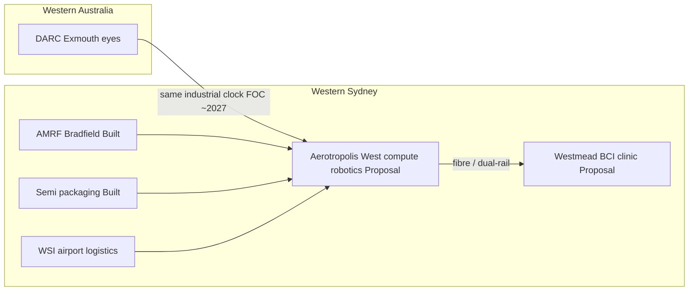

# Addendum: Aerotropolis West (Sydney) — distinctive prior art

**Sitting:** 23 Sep 2026 (follow-up to `OVERLAP-BRIEF.md`)  
**Point:** Richardson’s *Beyond Lucky* names “compute” as a national pillar in the abstract. Arena-Turner’s corpus already **sites** compute / robotics / BCI on a named Sydney precinct with Built neighbours, power/water gates, and a DARC coupling clock — **Aerotropolis West**. That material does not appear in his Pulse.

---

## 1. What you built on disk (Sydney axis)

| Artifact | Date / status | What it claims |
| --- | --- | --- |
| Geographic Brief § Aerotropolis West — [`06-GEOGRAPHIC-BRIEF.md`](../../archive/TerAustralis-Proposal/06-GEOGRAPHIC-BRIEF.md) | Proposal set | Two axes: Pilbara = recovery/feedstock; **Aerotropolis West = grid-adjacent compute, embodiment, fibre to Westmead**. Precinct surveyed (WSI / Bradfield / WSEA). Passenger opening **25 Oct 2026** (operator public). **150–250 MW** = planning range, not contracted. Recycled water for cooling. No site selected. NSW heritage / FPIC floor. |
| Sydney Station — [`sydney-station.html`](../../archive/TerAustralis-Proposal/sydney-station.html) | Invitation **13 Aug 2026** (on proposal site 20 Aug) | Two campuses: **Aerotropolis West** (compute + Optimus-grade robotics hall) + **Westmead** (Neuralink-grade BCI clinic, medical first). Explicitly **not** an official xAI / Tesla / Neuralink project. Six fail-closed rules (BYO power, no aquifer drink, permit the plant, two campuses / one command, channel ≠ merge, red dust landing). X original linked. |
| Named Pathway Brief — BCI + robotics @ Aerotropolis — [`named-pathway-brief-bci-robotics-aerotropolis.md`](../../archive/TerAustralis-Incognita/mythos/teraustralis/publish/named-pathway-brief-bci-robotics-aerotropolis.md) | Clocked to DARC FOC ~2027 | “Processing, not just ore” applied to **attention / human–machine stack**. Built neighbours: **AMRF Bradfield**, semiconductor advanced packaging (Second Building), WSI. Proposal: dual-rail BCI (Rail A tip/action · Rail B durée/consent). Falsifiable 24-month tests. |
| *After the radar* — [`op-ed-after-the-radar.md`](../../archive/TerAustralis-Incognita/mythos/teraustralis/publish/op-ed-after-the-radar.md) | Submitted SpaceNews Opinion **3 Sep 2026** | Public punchline: **“Exmouth gives AUKUS eyes. Aerotropolis can give Australia hands.”** AMRF + packaging = Built; BCI pathway must survive a spreadsheet before 2027. |
| Engineer sitting / Review Pack | Same package | Aerotropolis = working precinct (science); 150–250 MW plant = Vision, not forwarded as surveyed. |

Live steward link: `/bci-aerotropolis` in [`bio.js`](../../archive/TerAustralis-Incognita-Code/vision/site/src/lib/data/bio.js).

---

## 2. Architecture in one diagram

**Job split (your rule, repeated across docs):** Pilbara/Catch ≠ Aerotropolis. Recovery coast is not the Sydney compute campus. Richardson collapses “compute” into a national slogan; you already **separated geographies and belts** (Built vs Proposal vs Vision).

---

## 3. Vs *Beyond Lucky* — what he says about compute

Richardson (21 Sep 2026):

- Australia becomes attractive for **data centres** (energy + stability).
- Next step: AI value “hand on rather than … merely rent.”
- Compute as **applied layer** across resources and defence: discovery, logistics, defence systems, grid/water modelling.
- Platforms/models trained on Australian problems, owned onshore, licensed out.

**What he does not say:**

- Western Sydney Aerotropolis / Bradfield / Badgerys Creek / Kemps Creek
- AMRF or semiconductor packaging Second Building
- Westmead ethics / medical-first BCI
- Dual-rail consent architecture
- Coupling Sydney hands to Exmouth/DARC eyes on a 2027 clock
- 150–250 MW planning envelope, recycled-water cooling, BYO-power rule
- Any Named Pathway Brief or Sydney Station invitation

So on the Sydney axis: **your research is specific and dated; his is generic pillar language.** If someone only read *Beyond Lucky*, they would not know Aerotropolis West exists in your architecture.

---

## 4. Why this matters for the overlap argument

| Claim strength | Statement |
| --- | --- |
| Strong | You had a **sited Sydney compute/embodiment/BCI pathway** (Aug–Sep 2026 public invitation + Named Pathway + After the radar) while his Pulse only names compute nationally. |
| Strong | Your coupling sentence — eyes (Exmouth) / hands (Aerotropolis) — is a concrete industrial bargain his essay never makes. |
| Medium | Both want Australian-owned AI applied to resources and defence; that slogan is shared water. |
| Weak / absent | Any evidence he used your Aerotropolis docs. No citation; no precinct names. |

For a public reply, Aerotropolis is the cleanest “I already did the homework” receipt that does not require accusing him of theft: link Sydney Station + After the radar + Named Pathway Brief.

---

## 5. Suggested one-paragraph public receipt (optional)

> On the compute pillar: I’ve already argued a Western Sydney siting — Aerotropolis West beside Bradfield’s AMRF and packaging stack, coupled to DARC’s 2027 clock, with a dual-rail BCI pathway held as Proposal next to Built neighbours (*After the radar*; Sydney Station, 13 Aug 2026; Named Pathway Brief). National “own the AI” is right; the receipt is a precinct and a consent architecture, not only a slogan.

---

*Addendum only. Does not change the main brief’s plagiarism verdict.*
