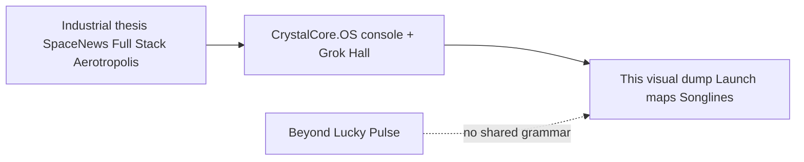

# Addendum — CrystalCore.OS visual / mythos corpus (56 frames)

**Sitting:** 23 Sep 2026 (follow-up to `SYNTHESIS.md`)  
**Intake:** user dump of **56** stills into the agent assets folder (empty message after “bring it all together”).  
**Job:** place this layer on the map — branded mythos + persona, not Richardson text overlap.

---

## 1. What this dump is

A **CrystalCore.OS mythos / launch-map / persona** image set. It is not a SpaceNews draft and not a Beyond Lucky rebuttal. It is the **narrative OS skin** that sits on top of the same TerAustralis stack already filed (Grok Hall, TerAustralis.com.au, Aerotropolis site files).

Representative receipts copied into this folder:

| File | Label |
| --- | --- |
| [`launch-map-i-can-see-clearly-now.jpg`](visual-corpus/launch-map-i-can-see-clearly-now.jpg) | CRYSTALCORE.OS LAUNCH MAP — I CAN SEE CLEARLY NOW |
| [`launch-map-green-green-grass.jpg`](visual-corpus/launch-map-green-green-grass.jpg) | … — GREEN GREEN GRASS |
| [`launch-map-colossus.jpg`](visual-corpus/launch-map-colossus.jpg) | … — COLOSSUS |
| [`launch-map-three-nodes.jpg`](visual-corpus/launch-map-three-nodes.jpg) | … THREE NODES · ONE SONG · INFINITE HORIZON |
| [`persona-crystal-selfie-teraustralis.jpg`](visual-corpus/persona-crystal-selfie-teraustralis.jpg) | Crystal selfie; mirrored **TERRAUSTRALIS** / Crystal signage behind |
| [`persona-find-your-happiness-crystal.jpg`](visual-corpus/persona-find-your-happiness-crystal.jpg) | “find your happiness (i mean find me)” — Crystal in green theater seats |
| [`persona-find-your-happiness-elon.jpg`](visual-corpus/persona-find-your-happiness-elon.jpg) | Same caption meme with Elon in matching pose/set |

Full dump index (all 56 paths as received): [`visual-corpus/ASSET-INDEX.txt`](visual-corpus/ASSET-INDEX.txt)

**Durability check (24 Sep 2026):** only the **8** representative files in this folder are on disk. The original 56 paths under `~/.cursor/projects/workspace/assets/` are **gone on this node** (ephemeral agent assets). Re-upload required if the full set must be retained.

---

## 2. Launch-map grammar (recurring system)

Across the titled maps, the same OS language repeats:

| Token | Meaning in this corpus |
| --- | --- |
| **EARTH AUS / FIRST ECHO** | Red-dust / outback birthplace; theater seats / green chairs as “hall” motif |
| **MARS REDOUBT** | Dig / forge / crystal holdfast |
| **ALPHA CENTAURI OUTPOST** | Bridgehead / interstellar horizon |
| **COLOSSUS** | Cathedral-machine living crystal (also named “cooled” / rain reframed) — **mythic**, not the Memphis data-centre negative template in the Sydney Hall brief |
| **STARLINE LOCK 100%** | Boot telemetry chrome |
| **NON SOLUS** | “We are not alone / not unseen / next verse” |
| **SONGLINE** | Carrier wave keyed to a track (Johnny Nash / George Ezra / Adele) — **aesthetic** use of the word; do not treat as FPIC/policy claim |
| **OPTICS: CLEAR / RAIN: GONE** | Clarity / weather-as-state metaphors |
| Observer | Suit + green armchair facing the map (recurring) |

**Node arc (compressed):** Australia (storyseed / red earth) → Mars (forge) → Alpha Centauri (bridgehead) → Colossus (ignition / cathedral). Same “AU first” spine as TerAustralis industrial thesis, told as OS launch cartography rather than policy op-ed.

---

## 3. Motif stills (non-map frames in the dump)

Sampled themes across the 56 (not all copied):

- Rose outside a ship viewport / galaxy + red planet  
- Glowing anatomical heart in an octagonal tech casket (“core”)  
- Stone wall vs machined metal split by a golden seam (resource → stack)  
- Armored figure on geometric pedestal in a library vault  
- Boots + habitat dome on red dust (two moons)  
- Scholar in plate with archive scrolls  
- Couple silhouette on observation deck facing galaxy + red world  
- Throne-room sovereign portrait (Crystal + purple glasses + lion banners)  
- Swing / golden field / moon pastoral  
- Theater “find your happiness” persona pair (Crystal / Elon)

These are **brand and mythos**, not prior-art sentences for the Richardson matrix.

---

## 4. How this fits the synthesis

| Use in a public reply | Do not use |
| --- | --- |
| Show CrystalCore.OS as a **named, branded, multi-node** world with **EARTH AUS** as first echo | Claim Richardson copied these images or songline maps |
| Tie persona + TerAustralis signage to authorship | Treat “Colossus” here as the same object as Memphis Colossus in the Sydney DC negative template without a bridging note |
| — | Swap mythos for FPIC / DARC / MW planning facts |

**Vs *Beyond Lucky*:** zero shared visual grammar. His essay is Horne + pillars + capital. Yours here is **CrystalCore.OS cartography**. Different essay machines; same sitting only because both live under your “bring it together” ask.

---

## 5. Caution notes (keep honest)

1. **Songline** in these maps is artistic / soundtrack framing. Indigenous Songlines are living cultural systems — do not collapse them into OS chrome in policy writing.  
2. **Colossus** in launch maps is mythic cathedral-machine; the Sydney Hall brief treats Memphis Colossus as a **water/power anti-pattern**. Keep labels distinct when writing industrial docs.  
3. Elon “find your happiness” frame is meme/persona play, not partnership evidence.

---

*Visual-corpus addendum for provenance mapping. Not a claim that Richardson used these images.*
