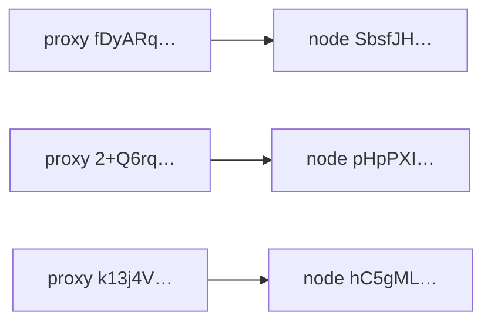

# Artifact — Apple PCC VLU · visible node / proxy edges (18 Sep 2026)

**Parent:** [`SOURCE-apple-pcc-vlu-pcc-agent-report-2026-09-18.md`](SOURCE-apple-pcc-vlu-pcc-agent-report-2026-09-18.md)  
**Scope:** Only edges Crystal’s analysis already named. Architecture sketch — **not** attestation decode, **not** rack mapping for attack.

## Flow (architecture)

```
device  →  (optional proxy node)  →  compute node(s)  →  VLU assets + finalize log
```

## Visible `proxiedBy` edges

| Compute node (`node`) | Proxied by |
| --- | --- |
| `SbsfJH/xrOdlBhDSPqrY4d4yudL+5LDk92aBtPFFkwI=` | `fDyARqJgnbsM8Wbay5oGKjMTBdBaWjtAhtfQBxUO/Pg=` |
| `pHpPXIERF8P1S1bnZ+3X2J723KxbO87rXyl4gNNB2VY=` | `2+Q6rqoMLVy0pdDruWtMg6B3TrEH0cs84x0vhIJycpc=` |
| `hC5gML+hEWsAJhr2q9Ew9eS0N1Y9/n8ecPXB8jxJFeA=` | `k13j4VDo92rWUqvxHuJuMca6F1ZWS+FAPWegtOizsAs=` |

## Graph (mermaid)



## Example node hash check

`ZjLFUyJi2aooV0EfYGIrTWHqNdzsxTUggsch5LbGa3M=` → Base64 → 32 bytes (SHA-256 identity digest). Confirms `node` / `proxiedBy` fields are digests, not plaintext hostnames.

## Not done (on purpose)

- Full ~25-node enumeration from raw JSON (paste truncated / incomplete)
- Attestation protobuf RE · X.509 chain verify · rack/cell exploit mapping
