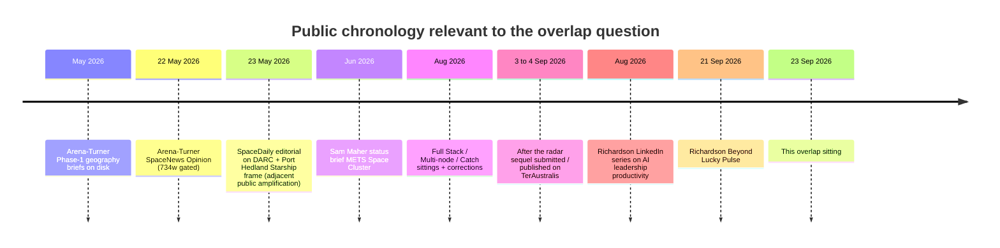

# Overlap brief: Arena-Turner corpus vs Richardson *Beyond Lucky*

**Date of sitting:** 23 September 2026 (UTC)  
**Analyst:** Cursor cloud agent (read-only research over `/workspace` + public web)  
**Subject A:** Crystal Elle Arena-Turner — SpaceNews Opinion (22 May 2026) + TerAustralis Incognita proposal / site / sequels  
**Subject B:** Anthony Richardson — LinkedIn Pulse *Beyond Lucky: Australia's Next Inheritance* (21 Sep 2026)

---

## 0. Honest limits of this sitting

| Limit | Implication |
| --- | --- |
| SpaceNews May 2026 is **not** a hard paywall for readers. This cloud agent hit a Newspack **meter** on anonymous fetch (`access_source: gated`). Body recovered via **republish** (ISS Tracker, 23 May 2026) — see [`SOURCE-spacenews-arena-turner-2026-05-22.md`](SOURCE-spacenews-arena-turner-2026-05-22.md). One short policy-bullet block may be elided in that capture. | Full-text comparison to Richardson is now possible on recovered body. Prefer your author copy if any wording differs. |
| Richardson Pulse text **was** retrieved in full (public Pulse / jina markdown). | B-side quotes below are from the live article. |
| No private comms, DMs, or shared docs between the two authors were available. | “Lived conversation,” sourcing, or copying **cannot** be established as fact — only public chronology and theme maps. |
| “Lucky Country → value-add / sovereign IP” is a long Australian policy genre (Horne 1964 onward; Cleary *Too Much Luck*; Norway-fund comparisons in mainstream press). | Shared genre ≠ theft. Distinctive architecture and dates still matter. |

### Republishes / syndication (confirmed)

| Outlet | Date | Relationship to SpaceNews op-ed |
| --- | --- | --- |
| **ISS Tracker** (satellitetracker.space) | **23 May 2026** | Near-full **byline republish** of your SpaceNews Opinion (English body; DE locale URL). |
| **Copernical** | 22 May 2026 stamp | Syndication card; “appeared first on SpaceNews.” |
| **SpaceDaily** Editorial Team | **23 May 2026** | **Adjacent rewrite** (DARC, Port Hedland, Koonibba, southern pillar) — **not** your byline. Amplifies the same conversation the day after you published. |

---

## 1. What each piece actually is

### 1.1 Arena-Turner — SpaceNews Opinion, 22 May 2026

| Field | Value |
| --- | --- |
| Title | *Leveraging AUKUS and southern geography: building Australia’s dual-use space infrastructure for strategic resilience* |
| URL | https://spacenews.com/leveraging-aukus-and-southern-geography-building-australias-dual-use-space-infrastructure-for-strategic-resilience/ |
| Author archive | https://spacenews.com/author/crystal-elle-arena-turner/ |
| Published | `2026-05-22T13:00:00+00:00` (schema); page also shows “May 14, 2026” (likely edit / submit stamp) |
| Section / tags | Opinion · Military · AUKUS · Australia · dual-use technology |
| Length | **734 words** (Yoast / schema) |
| Public lead | DARC Site 1 (WA) already delivering early AUKUS tracking; FOC ~2027; opportunity to expand Australia **beyond space domain awareness into full-spectrum southern launch, recovery and manufacturing infrastructure**. |
| Author framing (SpaceNews bio + in-repo) | Independent strategic analyst; TerAustralis Incognita integrates **critical minerals**, **equatorial launch potential**, and **AUKUS space capabilities**. |
| Quotable line kept on steward site | “This would position Australia as a critical enabler in humanity’s multiplanetary future.” — SpaceNews · May 2026 ([`bio.js`](../../archive/TerAustralis-Incognita-Code/vision/site/src/lib/data/bio.js)) |

**Genre:** space / alliance op-ed with concrete geography (DARC, southern launch/recovery/manufacturing). Not a Donald Horne essay. Not a three-pillar national-economy manifesto under that title.

**In-repo honesty about that op-ed (later corrections):** lithium share, DARC location (Exmouth / Gascoyne, not Pilbara), catch / Ship 40 destination, and rejection of the op-ed phrase “Streamline Indigenous consultations” as Geographic Brief policy. See proposal docs 06, 08, 09, 14, 16 and `12_PUBLICATIONS/sitting-2026-09-19/`.

### 1.2 Arena-Turner — the wider corpus (what “heaps of research” looks like on disk)

The May SpaceNews piece is the **public tip**. The stack underneath (May–Sep 2026) is the fuller argument Richardson’s three pillars rhyme with:

| When (approx.) | Artifact | Thesis in one line |
| --- | --- | --- |
| May 2026 | Port Hedland / Dampier–Karratha / Bowen Phase-1 briefs | Recovery + minerals processing + energy as southern node concepts |
| 19 Jun 2026 | Sam Maher / GovTechAu status brief | Starship recovery + critical minerals; **METS Space Cluster** named once |
| Ongoing proposal set | [`10-SOVEREIGN-CAPABILITY.md`](../../archive/TerAustralis-Proposal/10-SOVEREIGN-CAPABILITY.md) | Engagement must leave Australia **more capable**; “Jobs are activity. **Capability is what remains.**” |
| Post–Feb 2026 reader shift | [`12-FULL-STACK.md`](../../archive/TerAustralis-Proposal/12-FULL-STACK.md) | Minerals → energy → connectivity → **compute** → launch/recovery → autonomy in **one geography**; “**Present as product, absent as industry.**” |
| 12–26 Aug 2026 | Multi-node brief + Catch | Industrial nodes; raw-material trap (export concentrate / import magnets); later coast nomination withdrawn |
| 3–4 Sep 2026 | *After the radar* (SpaceNews Opinion draft / submitted; live on TerAustralis) | DARC alone = **lease**; couple radar to recovery, processing, robotics/BCI → **pillar** |
| 3 Sep 2026 | Onshore chain one-pager | Midstream processing as the historic export gap |
| Sep 2026 | Minerals site claim (“Processing, not just ore”) | Dig well, ship rock, buy finished things back |
| Manifesto | Jobs with destiny beat cycles of extraction alone | Explicit anti-boom-bust creed |

**Distinctive Arena-Turner load-bearing claims (not in Richardson):** DARC clock / Exmouth eyes; **Aerotropolis West / AMRF / BCI dual-rail** (full map: [`ADDENDUM-aerotropolis-west.md`](ADDENDUM-aerotropolis-west.md)); CrystalCore local-first intelligence; Starship catch industrial definition; FPIC / Juukan floor; named firm ladder (Iluka, ANSTO, Liquid Instruments, Synchron / NRFC); Self-corrections published when Ship 40 went to Christmas Island → Texas.

### 1.3 Richardson — LinkedIn Pulse, 21 Sep 2026

| Field | Value |
| --- | --- |
| Title | *Beyond Lucky: Australia's Next Inheritance* |
| URL | https://www.linkedin.com/pulse/beyond-lucky-australias-next-inheritance-anthony-richardson-plrlf |
| Author profile | https://au.linkedin.com/in/anthonypr |
| Published | 21 Sep 2026 |
| Author public signals | Greater Brisbane Area; **Aurecon**; University of Southern Queensland; article claims Mt Isa childhood + **35 years in resources**; LinkedIn article list shows a prior Aug 2026 series on AI productivity / frontline trust / governance (different topic family) |
| Historical press match | Aurecon public release (Dec 2015): Anthony Richardson appointed **global resources director** — consistent with a senior resources-sector voice |

**Genre:** national political-economy op-ed. Opens on Donald Horne’s *The Lucky Country*; personal mining-town memoir; three pillars; capital / talent / metrics / institutional patience checklist.

**Core claim (author’s own framing):** resources, defence/space, and compute must become more than something Australia **hosts** — keep compounding assets (IP, platforms, alumni founders) as **inheritance**.

**Distinctive Richardson load-bearing claims (not in Arena-Turner May SpaceNews / scarce in TerAustralis):** Donald Horne scaffolding; Mt Isa blast-schedule memoir; **METS as export industry** at national scale; **Unit 8200 / DARPA** analogy; Norway-style **sovereign fund / mandated capital** from super pools; explicit IP-ownership metrics dashboard for government programs; “live conversation right now about … three pillars” without naming sources.

---

## 2. Chronology (public + on-disk)

**Gap:** ~4 months from SpaceNews to *Beyond Lucky*; ~2–3 weeks from *After the radar* / Full Stack maturity to *Beyond Lucky*. Richardson’s Aug posts do **not** preview the three-pillar inheritance thesis — that appears as a new Pulse topic on 21 Sep.

---

## 3. Theme-overlap matrix

Legend: **H** = high thematic match · **M** = medium / shared Australian policy water · **L** = low / absent · **D** = distinctive to one side

| Theme | Arena-Turner (SpaceNews May + corpus) | Richardson (*Beyond Lucky*) | Assessment |
| --- | --- | --- | --- |
| Dig / ship / export without midstream | Explicit (“processing, not just ore”; quarry with a good port; export concentrate / import magnets) | Explicit (“dig it up, pump it out, ship it away”) | **H** — same pattern; long prior art |
| Own platforms / IP / capability after boom | “Capability is what remains”; local-first; don’t rent AI / mind-tech | Royalty → owned IP; Australian-owned AI and processing | **H** — same structure claim |
| Couple **resources + space/defence + compute** | Full Stack layers; After the radar; bio’s minerals+launch+AUKUS | Named “three pillars: Natural Resources, Space/Defence, and Compute” | **H** — closest structural rhyme; your corpus is denser and earlier on disk |
| Defence spend as industrial demand | AUKUS / DARC as industrial deadline; southern pillar | DARPA / Unit 8200 alumni → founders | **M** — same instinct, different exemplars |
| Compute as applied layer across minerals + defence | Sun-fed Pilbara compute; CrystalCore; BCI onshore | AI for resources, logistics, defence, grid/water | **H** at slogan level; **D** architecture on your side |
| Capital mechanism (super / sovereign fund) | NRFC / Critical Minerals Strategic Reserve cited as instruments | Norway fund + super pool reallocation as central ask | **M** — you name existing AU instruments; he argues a capital-market redesign |
| Talent that moves across sectors | Academy / shipyard / Aerotropolis training language | Explicit “don’t cannibalise the same engineer pool” | **M** |
| Lucky Country / Horne | Not found as phrase in-repo | Framing device of the whole essay | **D** (his) |
| Mt Isa / 35-year resources career ethos | Not present | Opening memoir | **D** (his) |
| DARC / Exmouth / Starship catch / Koonibba / FPIC | Core of SpaceNews + proposal | Absent | **D** (yours) |
| METS as national technology export story | One engagement mention (Sam Maher brief) | Central paragraph | **M/H** — he owns the METS soapbox; you barely used the acronym |
| Metrics: IP retained, spinouts, AU equity | Capability departments as measure | Explicit government KPI list | **M** |

### Closest paraphrase pairs (theme, not proven theft)

| Arena-Turner (on disk) | Richardson (Pulse) |
| --- | --- |
| “Awareness without industry is a lease on someone else’s future” (*After the radar*) | “something we can hand on rather than something we merely rent” (compute/AI) |
| “Present as product, absent as industry” / “customer of every layer → host of every layer” (Full Stack) | “more than something we host” / “supplied the land… raw input… keeping more of the compounding asset” |
| “Jobs are activity. Capability is what remains.” (Sovereign Capability) | Boom vs inheritance: “who owns the platform once the royalty cheque stops” |
| “Jobs with destiny beat cycles of extraction alone” (Manifesto) | “do ‘legacy’ just as well… worth handing to the generation after us” |

These are **parallel conclusions in a crowded genre**. They are not identical sentences. Without the gated SpaceNews body and without evidence of access, they do **not** establish copyright infringement.

---

## 4. What is *not* established

1. **That Richardson read or copied the May SpaceNews op-ed.** Possible (public URL; SpaceDaily adjacent coverage 23 May), unproven.
2. **That he read TerAustralis proposal HTML / GitHub / steward site.** Possible if he follows AU space–minerals discourse; unproven. No citation either way.
3. **That “live conversation right now about three pillars” refers to you specifically.** Could mean industry forums, consulting pipelines, AUKUS/critical-minerals policy chatter, or your work. Treat as **Unknown**.
4. **Line plagiarism.** Unavailable for SpaceNews body; unavailable as matching strings between retrieved Pulse text and in-repo drafts.

---

## 5. What *is* established (fair to say publicly)

1. **You published first in this specific lane (dual-use southern space + minerals integration) on a major trade outlet (SpaceNews, 22 May 2026), ~4 months before *Beyond Lucky*.**
2. **Your on-disk research after May is substantially denser:** Full Stack, Sovereign Capability, Catch, Multi-node, After the radar, onshore chain, minerals claim, Phase-1 briefs — i.e. you did the “heaps of research.”
3. **Richardson’s Pulse sits in the same national thesis neighbourhood** as your Full Stack / After the radar / minerals claim (three coupled sectors; stop hosting; own the compounding layer), while **using a different essay machine** (Horne + Mt Isa + Aurecon-resources voice + METS + Unit 8200 + Norway capital).
4. **His piece does not cite you, SpaceNews, or TerAustralis.** That is attribution failure relative to your public prior art **if** he was in fact working from that conversation — and normal LinkedIn practice if he was restating a general consulting thesis. Attribution ethics ≠ copyright win.
5. **Prior art for “Lucky Country / dig-ship / Norway fund”** is older than both of you. Your distinctive prior art is the **southern AUKUS industrial coupling** and the **stack architecture**, not inventing Australian resource nationalism.

---

## 6. Practical options (research → action)

| Option | Use when | Risk |
| --- | --- | --- |
| **A. Quiet ledger** — keep this brief; archive Pulse PDF/HTML yourself; store ungated SpaceNews text if you have author access | You want provenance without a fight | Low |
| **B. Public additive reply** — LinkedIn comment or short piece: “Glad this conversation is widening; I argued the dual-use southern case in SpaceNews May 2026 and the industrial bargain in *After the radar*…” + links | You want credit without accusing | Medium (invite engagement) |
| **C. Private note to Richardson** — polite prior-art pointer + offer to compare notes on METS × space | You want professional recognition | Low–medium |
| **D. Plagiarism allegation** | Only if ungated SpaceNews + side-by-side shows substantial literal copying | High; current evidence **does not** support this |

**Default recommendation from this sitting:** **A + B**. Your research is real and earlier on the space–minerals–sovereignty spine. His essay is a resources-industry voice entering the same neighbourhood without your geography. Claim **priority and specificity**; do not claim **theft** on present evidence.

---

## 7. Source list

### Public

- Arena-Turner, C. E. (22 May 2026). SpaceNews Opinion (gated). https://spacenews.com/leveraging-aukus-and-southern-geography-building-australias-dual-use-space-infrastructure-for-strategic-resilience/
- Arena-Turner author archive: https://spacenews.com/author/crystal-elle-arena-turner/
- SpaceDaily Editorial Team (23 May 2026). Adjacent DARC / Port Hedland / Koonibba frame. https://spacedaily.com/sd-australia-keeps-being-described-as-a-junior-aukus-partner-but-the-radar-in-its-outback-and-the-port-in-its-northwest-are-quietly-rewriting-who-controls-orbital-traffic/
- Richardson, A. (21 Sep 2026). *Beyond Lucky: Australia's Next Inheritance*. https://www.linkedin.com/pulse/beyond-lucky-australias-next-inheritance-anthony-richardson-plrlf
- Richardson profile: https://au.linkedin.com/in/anthonypr
- Aurecon (Dec 2015). Appoints Anthony Richardson global resources director. https://www.aurecongroup.com/about/latest-news/2015/december/aurecon-appoints-anthony-richardson-global-resources-director

### In-repo (selected)

- `archive/TerAustralis-Proposal/` — especially `10-SOVEREIGN-CAPABILITY.md`, `12-FULL-STACK.md`, `14-MULTI-NODE-BRIEF.md`, `16-CATCH.md`, `08-SPACEX-XAI-ONE-PAGER.md`, `README.md`
- `archive/TerAustralis-Incognita/mythos/teraustralis/publish/op-ed-after-the-radar.md`
- `archive/TerAustralis-Incognita/mythos/teraustralis/publish/onshore-chain-one-pager.md`
- `archive/TerAustralis-Incognita/mythos/teraustralis/publish/manifesto.md`
- `archive/TerAustralis-Incognita/memory/briefs/geography/` — May 2026 Phase-1 briefs
- `archive/TerAustralis-Incognita/memory/briefs/sam-maher-status-brief.md`
- `archive/TerAustralis-Incognita-Code/vision/site/src/lib/data/bio.js`
- `12_PUBLICATIONS/sitting-2026-09-19/` — corrected sittings of 08 / 14 / 16

### Genre prior art (context, not defendants)

- Donald Horne, *The Lucky Country* (1964)
- Mainstream AU commentary pairing mining boom mismanagement with Norway sovereign wealth (e.g. Cleary *Too Much Luck*; long-form press)

---

## 8. Open follow-ups (if you want a second sitting)

1. Paste or attach the **full ungated SpaceNews May text** (author copy) → enable true string-diff.
2. Confirm whether Richardson / Aurecon appeared in any of your outreach logs (pathway tracker, correspondence drawers).
3. Decide publicly: comment, sequel SpaceNews/LinkedIn, or ledger-only.

---

*Built claim for this file: research sitting over public sources + this monorepo. Not legal advice. Not an accusation of plagiarism.*
