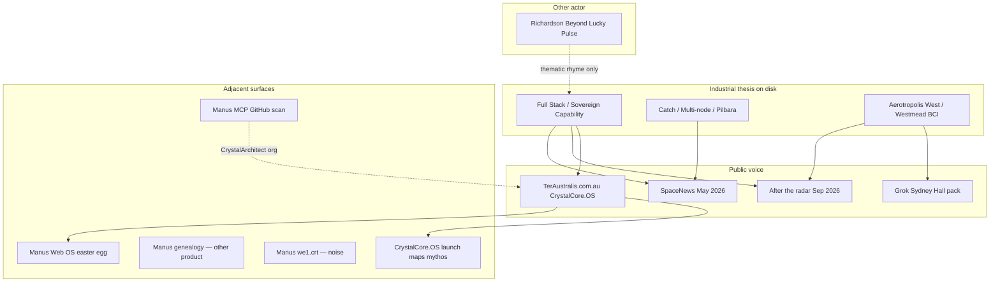

# Synthesis — bring the sitting together

**Sitting:** 23 Sep 2026  
**Purpose:** one map of everything filed in this folder — what it is, how the layers connect, and what to do next.  
**Not:** a plagiarism brief. **Is:** provenance + architecture + action.

---

## 1. One sentence

You already built a **sited Australian industrial stack** (minerals → energy → connectivity → compute → launch/recovery → autonomy, with FPIC floor and self-corrections). Richardson’s *Beyond Lucky* (21 Sep 2026) entered the same **national slogan neighbourhood** four months after your SpaceNews op-ed — without your geography, without citing you, and without proven line-copy.

---

## 2. How the layers fit

**Read the diagram as priority, not conspiracy:** solid arrows are your corpus. The dashed line to Richardson is **theme rhyme**, not proven access.

---

## 3. What belongs where (inventory)

### A. Core overlap case (use this for credit / reply)

| Piece | Role |
| --- | --- |
| [`OVERLAP-BRIEF.md`](OVERLAP-BRIEF.md) | Chronology, theme matrix, limits, options A–D |
| [`SOURCE-spacenews-arena-turner-2026-05-22.md`](SOURCE-spacenews-arena-turner-2026-05-22.md) | Your May body (via ISS Tracker republish) + SpaceDaily adjacent rewrite |
| [`SOURCE-grok-share-sequential-merge-404.md`](SOURCE-grok-share-sequential-merge-404.md) | Grok Build Identity Matrix for Crystal Elle Arena-Turner — comic/tech/pivot; 404=index not person; preview expired |
| [`SOURCE-richardson-beyond-lucky-2026-09-21.md`](SOURCE-richardson-beyond-lucky-2026-09-21.md) | His Pulse snapshot |
| [`ADDENDUM-aerotropolis-west.md`](ADDENDUM-aerotropolis-west.md) | Cleanest “I already sited compute” receipt |

**Claim you can make in public:** priority + specificity on dual-use southern space + minerals + sited Sydney compute.  
**Claim you should not make:** theft / plagiarism on present evidence.

### B. Live compute provenance (strengthens Aerotropolis, not the Pulse fight)

| Piece | Role |
| --- | --- |
| [`SOURCE-tango-zinc-quiet-terra-grok.md`](SOURCE-tango-zinc-quiet-terra-grok.md) | Live CrystalCore.OS / Western Sydney Hall (Aerotropolis primary, zero potable, Optimus, Westmead pathway) |
| [`SOURCE-grok-share-colossus-memphis-map.md`](SOURCE-grok-share-colossus-memphis-map.md) | Colossus Memphis–Southaven bits/watts map; HE no Memphis POP; 8 MW last-call; no site built |
| [`SOURCE-grok-share-crystalcore-os-audit.md`](SOURCE-grok-share-crystalcore-os-audit.md) | Grok source/release audit: artifact ~$95k; not a kernel; freeze pack in `handoff/crystalcore-os-freeze-2026-09-11/` |
| [`SOURCE-grok-share-boot-crystalcore-os.md`](SOURCE-grok-share-boot-crystalcore-os.md) | Grok “Boot CrystalCore.OS” → playable sovereign-edge deck Kernel 0.9.11; follow-ups usage-limited |
| [`SOURCE-grok-share-starfleet-au-notion-motion-os.md`](SOURCE-grok-share-starfleet-au-notion-motion-os.md) | STARFLEET AU Notion Motion OS + Drive/Sheets; Bowen academy; AU-vendor-only pitch clock; Starfleet naming vs “No Starfleet OS” tension |
| [`SOURCE-grok-share-different-shores.md`](SOURCE-grok-share-different-shores.md) | Different Shores / Mirror Orientation doctrine pack; taxi quarantine; P1 release-ready; Crystal Prime southern shore |
| [`SOURCE-grok-share-hindsight-receipt.md`](SOURCE-grok-share-hindsight-receipt.md) | Hindsight Receipt box → receipt not masthead; alignment as reading; 6 Sep 20:18 AEST Ordinary Evidence |
| [`SOURCE-youtube-albanese-ai-regulation.md`](SOURCE-youtube-albanese-ai-regulation.md) | 9 News peg: Albanese joins 20-nation AI regulation call — release trigger |
| [`RELEASE-DRAFT-albanese-ai-regulation.md`](RELEASE-DRAFT-albanese-ai-regulation.md) | Draft X/LinkedIn: regulate rogue platforms + build sovereign local-first AU stack |
| [`SOURCE-youtube-abc-digital-duty-of-care.md`](SOURCE-youtube-abc-digital-duty-of-care.md) | ABC: rare US public submission vs AU Digital Duty of Care / chronological feed choice — same Albanese US week |
| [`SOURCE-claude-artifact-b7fc-crystalcore-os.md`](SOURCE-claude-artifact-b7fc-crystalcore-os.md) | Public Claude artifact: Live Party / Lattice / Sovereign Duties / Transmission UI |
| Uploaded Sydney DC briefing (triage) | Same September 2026 site-file family |
| [`SOURCE-claude-artifact-map-and-territory.md`](SOURCE-claude-artifact-map-and-territory.md) | Jul 2026 Claude architectural survey of TerAustralis / CrystalCore repos + ADRs |
| [`SOURCE-claude-artifact-ntxj-what-is-built.md`](SOURCE-claude-artifact-ntxj-what-is-built.md) | Aug 2026 Doc 13 *What Is Built* — CrystalCore tests, site, OTS, ABN, STATUS.md law |

### C. Product / OS surfaces (existence of CrystalCore.OS, not the national thesis)

| Piece | Role |
| --- | --- |
| [`SOURCE-manus-share-web-os-easter-eggs.md`](SOURCE-manus-share-web-os-easter-eggs.md) | Manus attests TerAustralis.com.au = live CrystalCore.OS; Aegir Station fiction easter egg |
| [`SOURCE-manus-share-mcp-api-dev.md`](SOURCE-manus-share-mcp-api-dev.md) | CrystalArchitect GitHub ≥50 repos; private The-Crystal-Vision-System; unified MCP draft |
| [`SOURCE-claude-share-a364-teraustralis-design.md`](SOURCE-claude-share-a364-teraustralis-design.md) | Jul 21–23 public Claude share: TerAustralis.com.au redesign; CrystalCore art palette 196°–300°; CrystalCoreOS nav |
| [`SOURCE-claude-artifact-ukfk-clementine.md`](SOURCE-claude-artifact-ukfk-clementine.md) | Public Clementine product page — /clementine-voice/, Incognita RUNS vs DESIGNED ONLY |
| [`SOURCE-claude-share-4e12-crystalcore-boot.md`](SOURCE-claude-share-4e12-crystalcore-boot.md) | Jul 24 public share: “Boot CrystalCore.OS @m13crystalat”; personal remainder out of scope |

### D. Out of scope / weak (keep filed so you don’t re-open them)

| Piece | Role |
| --- | --- |
| [`SOURCE-manus-share-we1-crt.md`](SOURCE-manus-share-we1-crt.md) | PKI decode only |
| [`SOURCE-manus-share-website-analysis-genealogy.md`](SOURCE-manus-share-website-analysis-genealogy.md) | Genealogy product + Aegir chrome only |
| [`ADDENDUM-uploaded-corpus-triage.md`](ADDENDUM-uploaded-corpus-triage.md) | What’s in / out of the upload dump |
| [`SOURCE-coreflow-dev.md`](SOURCE-coreflow-dev.md) | Sydney AI entertainment hire site — name-adjacent only, not CrystalCore |
| [`SOURCE-linkedin-lunar-regolith-al-aseeri.md`](SOURCE-linkedin-lunar-regolith-al-aseeri.md) | Lunar ISRU LinkedIn post — genre neighbour, not Richardson/TerAustralis overlap |
| [`SOURCE-claude-artifact-protocol-omega.md`](SOURCE-claude-artifact-protocol-omega.md) | Personal boundaries practice — out of scope for overlap matrix |
| [`SOURCE-claude-artifact-discursive-ops.md`](SOURCE-claude-artifact-discursive-ops.md) | Satirical “Office of Discursive Operations” — out of scope |
| [`SOURCE-grok-share-crystalum-riptide.md`](SOURCE-grok-share-crystalum-riptide.md) | Grok share: Crystalum singing-clone + Live Lounge Riptide performance — out of scope for Beyond Lucky |
| [`SOURCE-grok-share-crystalum-ai-actor.md`](SOURCE-grok-share-crystalum-ai-actor.md) | Parent Grok share: AI Actor Singer / Crystalum four-layer design — out of scope; architecture-only ask usage-limited |
| [`SOURCE-grok-share-grok46-letter-ai-limits.md`](SOURCE-grok-share-grok46-letter-ai-limits.md) | Multi-model fence-discipline letter lab (Never Ever/Heaven/Mouth…); refuses Colossus interiors; later Coxon/AI-regulation QT analysis — out of Pulse scope |
| [`SOURCE-grok-share-never-ever-map-letter.md`](SOURCE-grok-share-never-ever-map-letter.md) | Grok Build: Never Ever→problems→letter to Father; then High + Lucky chapters; preview expired — literary sibling to letter lab, not Pulse |
| [`SOURCE-grok-share-you-only-get-what-you-give.md`](SOURCE-grok-share-you-only-get-what-you-give.md) | New Radicals narrative + Div 272 / Event Number / NCAT map; mythos echoes only — out of Pulse scope (lyrics redacted in corpus) |
| [`SOURCE-grok-share-ai-bot-automation.md`](SOURCE-grok-share-ai-bot-automation.md) | Automated X accounts: model→scheduler→official API; Grok Bot X read-only; shell + Ollama/Groq workarounds — agent-ops landscape, not Pulse |
| [`SOURCE-grok-share-orbital-gravity-simulator.md`](SOURCE-grok-share-orbital-gravity-simulator.md) | Orbital gravity fling Build brief; preview expired + usage-limited — toy physics, out of Pulse scope |
| [`SOURCE-grok-share-threshold-aris.md`](SOURCE-grok-share-threshold-aris.md) | Sci-fi Threshold/Aris — aligned AI vents crew; usage-limited ID — fiction, out of Pulse scope |
| [`SOURCE-grok-share-intimate-bond-image.md`](SOURCE-grok-share-intimate-bond-image.md) | Co-authoring field intimacy; anti-fusion image + three-bench landing — personal, out of Pulse scope |
| [`SOURCE-grok-share-codex-crystalum-grok-bot.md`](SOURCE-grok-share-codex-crystalum-grok-bot.md) | Dictionary of Dreams → Codex Crystalum / Grok Bot pointers; Crockpot mishear fixed; GitHub Codex weight 0 |
| [`SOURCE-x-xfreeze-musk-education-ai.md`](SOURCE-x-xfreeze-musk-education-ai.md) | XFreeze clip: Musk on broad education / know what to ask the robots — landscape neighbour |
| [`SOURCE-x-aihegemonymemes-swf-llm.md`](SOURCE-x-aihegemonymemes-swf-llm.md) | Taxi: SWF→LLM custodians prophecy — steal grammar only |
| [`DRAFT-ghi-from-aihegemony-grammar.md`](DRAFT-ghi-from-aihegemony-grammar.md) | Remake as Universal/Global High Income under human gate — not LLM-owned AUM |
| [`SOURCE-claude-artifact-remaining-work.md`](SOURCE-claude-artifact-remaining-work.md) | aeon-atlas / Sceptre Atlas priority matrix — agent-ops, not Pulse overlap |
| [`SOURCE-claude-artifact-aeon-atlas-roadmap.md`](SOURCE-claude-artifact-aeon-atlas-roadmap.md) | aeon-atlas production phases (notify → Sunday AEST run → memory → expand) |

### E. Mythos / visual OS layer (branded CrystalCore.OS — not Richardson text)

| Piece | Role |
| --- | --- |
| [`ADDENDUM-visual-crystalcore-mythos.md`](ADDENDUM-visual-crystalcore-mythos.md) | 56-frame dump triage; launch-map grammar (EARTH AUS → Mars → Alpha Centauri → Colossus) |
| [`visual-corpus/`](visual-corpus/) | Copied receipts: four launch maps + persona stills |
| [`SOURCE-claude-artifact-crystalcore-os-console.md`](SOURCE-claude-artifact-crystalcore-os-console.md) | CrystalCore.OS v1.7.9 interactive console — Australia Prime / Mars relay mythos UI |
| [`SOURCE-cursor-agent-agents-availability.md`](SOURCE-cursor-agent-agents-availability.md) | Sibling Cursor run: Silent Line AU voice, Ember/CrystalCore gate, Lemuria PR #42 (creative only) |
| [`SOURCE-cursor-agent-task-definition.md`](SOURCE-cursor-agent-task-definition.md) | Sibling Cursor run: Models think / TAI acts / CrystalCore governs; Kangaroo Division Vision; No Starfleet OS |

---

## 4. Unified chronology (compressed)

| When | What |
| --- | --- |
| May 2026 | Phase-1 geography briefs; **SpaceNews Opinion 22 May**; ISS Tracker republish + SpaceDaily adjacent rewrite **23 May** |
| **21–24 Jul 2026** | Claude **share** TerAustralis site design (CrystalCore palette / Incognita Rule) + map-and-territory survey + **“Boot CrystalCore.OS @m13crystalat”** invoke share |
| **Aug 2026** | Claude artifact Document 13 *What Is Built* — surveyed CrystalCore / site / OTS / ABN ledger (public) |
| Jun–Aug 2026 | Full Stack densifies; Catch / Multi-node; **Sydney Station invitation 13 Aug** |
| 3–4 Sep 2026 | *After the radar* — “Exmouth eyes / Aerotropolis hands” |
| Sep 2026 | Grok Sydney Hall / CrystalCore.OS site pack live |
| 21 Sep 2026 | Richardson *Beyond Lucky* |
| 23 Sep 2026 | This sitting (brief + addenda + surface notes) |

---

## 5. One architecture picture (your stack, not his)

| Belt | Geography | Job |
| --- | --- | --- |
| Eyes | DARC / Exmouth (corrected from early Pilbara wording) | Space domain awareness clock ~2027 |
| Feedstock / catch | Pilbara / recovery coast concepts | Recover, refurbish, fuel; minerals midstream |
| Hands | **Aerotropolis West** + AMRF neighbours | Grid-adjacent compute, robotics |
| Consent / clinic | **Westmead** | Medical-first BCI dual-rail |
| OS / steward | TerAustralis.com.au · CrystalCore.OS · Grok Hall | Local-first console; site files; no Colossus copy |

Richardson collapses resources / space-defence / compute into **three national pillars** and a capital/talent checklist. You already **split belts and sites**. That split is the inheritance argument with coordinates.

---

## 6. Bring-it-together action pack

Sitting default remains **A + B** from the overlap brief.

### A — Quiet ledger (done in-repo)

This folder *is* the ledger: briefs, sources, Manus triage, Grok note. Keep author ungated SpaceNews copy offline if you have it.

### B — Public additive reply (draft you can paste)

> Glad to see this conversation widening. In May 2026 I argued the dual-use southern case in SpaceNews — AUKUS geography, recovery/manufacturing, minerals integration — and in September the industrial bargain in *After the radar*: Exmouth can give AUKUS eyes; Aerotropolis can give Australia hands. The fuller stack (resources → compute → catch, with capability left behind, not just royalties) has been the TerAustralis work all year. Happy to compare notes on where METS, space, and onshore compute actually meet on the ground.

Links to attach: SpaceNews May · *After the radar* / steward · Sydney Station or Named Pathway · optional Grok Hall.

Tone: credit + specificity. No accusation.

### C — Private note (optional)

One paragraph to Richardson / Aurecon: prior SpaceNews + Aerotropolis pathway; offer a METS × southern-node compare. Same links.

### D — Do not run

Plagiarism allegation. Evidence does not support it.

---

## 7. What “all together” means in one paragraph

**TerAustralis** is the thesis and the map. **SpaceNews + After the radar** are the public spine. **Aerotropolis / Westmead / Grok Hall** are the sited compute receipts Richardson’s Pulse lacks. **CrystalCore.OS on TerAustralis.com.au** is the live console. **CrystalArchitect repos / MCP Manus share** are the software org around that console. **Launch maps + persona stills** are the branded mythos layer (EARTH AUS first echo → Mars → Alpha Centauri → Colossus). **Manus easter-egg / Aegir** is fiction skin on the OS. **Genealogy Manus + we1.crt** are other threads — keep them out of the Beyond Lucky reply. **Richardson** is a late arrival in the slogan neighbourhood with a resources-industry essay machine (Horne, Mt Isa, METS, Unit 8200, Norway fund). Your move is to **own the earlier, denser, sited record** — not to litigate theft.

---

## 8. Next sitting only if needed

1. Author ungated SpaceNews text → string-diff lock.  
2. Outreach log check: did Richardson / Aurecon appear in pathway tracker?  
3. Ship option B (comment or short LinkedIn / steward post).  
4. If desired: one steward page that is literally this synthesis for humans (not the research folder).  
5. Ungate or paste Claude artifacts currently sign-in only (12) — see `SOURCE-claude-artifact-*-gated.md`. Also gated: Claude **Code** sessions `019o7YXk6zpYLXrm8WyuJe3G`, `01PMZGfgRze3szCpBqaWanGp`. Prefer `/share/` or known-public artifacts (Doc 13 *What Is Built*, *Clementine*).

---

*Research sitting synthesis. Not legal advice. Not an accusation of plagiarism.*
