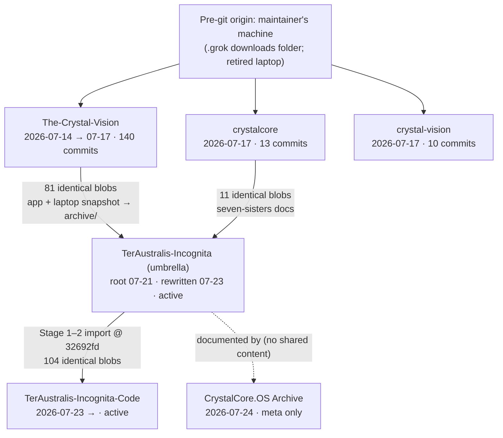

# Repository Archaeology — 2026-07-24

A read-only survey of all six Crystal-universe repositories, run with an
identical command battery per repository. This report records what
exists, not what should exist. Every claim carries an evidence tier.

**Snapshot:** fresh local clones surveyed 2026-07-24 (~11:27 container
time, UTC); remote refs re-checked live the same session with
`git ls-remote`. Repository locations were verified on disk before the
battery ran (none assumed); all six were present.

## Evidence tiers

- **Tier A — git object database.** Commit hashes, dates, authorship,
  and blob identity read from the local clones. Content-addressed;
  strongest evidence. (A blob SHA shared by two repos means the file
  content is byte-identical, regardless of history.)
- **Tier B — live remote refs.** `git ls-remote` against each `origin`
  this session: tags and branches as they exist on GitHub right now.
- **Tier C — the repositories' own documents.** READMEs, `STATUS.md`,
  this archive's knowledge base. These are claims, cited as claims, and
  marked where Tier A/B independently corroborates them.

---

## Verdict: which repository is canonical?

No single repository is canonical for everything — the system is
deliberately split by role, and the split is real in the git evidence,
not just in the documents:

| Axis | Canonical repository | Decisive evidence |
|---|---|---|
| Authority, governance, canon/mythos | `TerAustralis-Incognita` (umbrella) | Most recent activity of all six (last commit `5d40aff`, 2026-07-24 21:15 +1000); 117 commits, 393 files; holds `Project-Boundaries.md`, `Migration-Plan.md`, ADRs; the `-Code` repo's own README derives its existence from this repo's charter (Tier C corroborated by Tier A/B below) |
| Software — engine, app, site | `TerAustralis-Incognita-Code` | Contents provably descend from the umbrella's canon branch: 104 byte-identical blobs (Tier A), and the cited import source `claude/crystalcore-boot-visual-jau1bk @ 32692fd` verified live on the umbrella remote at exactly `32692fd9b103bd11875fc362a6fcac01b4b65258` (Tier B). CI, Pages deploy, and `CNAME` live here (Tier A: files in tree) |
| System ledger / meta-record | `CrystalCore.OS-the-Crystal-Architecture-Archive` | Newest repo (root `992b591`, 2026-07-24 03:45 +1000); 15 files, all Markdown; documents the other five; no unique application content |
| Historical origin (deepest ancestry) | `The-Crystal-Vision` | Oldest commit anywhere in the six repos (`caeab7d`, 2026-07-14 16:38 +1000); the only repo with external/bot history (v0, vercel[bot], dependabot[bot]); dormant since 2026-07-17 23:39 −0800 |
| Frozen ancestors | `crystalcore`, `crystal-vision` | Entire history is 2026-07-17 (−0800); superseded by copies in the umbrella and `-Code` trees |

**One-line answer:** if a single repository must be named the canonical
source today, it is **`TerAustralis-Incognita`** — every other active
repository's authority derives from its charter, and the code
repository's content provably descends from its canon branch. But the
deepest git ancestry lives in `The-Crystal-Vision`, and the running
software now lives in `TerAustralis-Incognita-Code`.

---

## Timeline (Tier A unless marked)

| When (as recorded) | Event |
|---|---|
| 2026-07-14 16:38 +1000 | `The-Crystal-Vision` first commit (`caeab7d`, "Initial commit") — the oldest commit in any of the six repos |
| 2026-07-14 → 07-17 | 140 commits land in `The-Crystal-Vision`, including the only external actors seen anywhere: v0 (7), vercel[bot] (3), dependabot[bot] (2), one external human author (1) |
| 2026-07-17 06:45 −0800 | `crystal-vision` created (`0b03c6a`); content labeled "Grok Build v0.4.0" |
| 2026-07-17 09:50 +1000 | `crystalcore` created (`35030f7`, "CrystalCore Seven Sisters pack") |
| 2026-07-17 12:53 +1000 | Commit later marked by checkpoint tag `vision-safe-2026-07-17` (`b9fcd83`) |
| 2026-07-17 (+1000) | Laptop snapshot committed to `The-Crystal-Vision` as a separate root (`5c878db`, "Initial local snapshot for code review") |
| 2026-07-17 23:39–23:41 −0800 | Coordinated final pass ("licensing, security policy, Crystal universe labeling"; branch `claude/chat-session-2v6e0t`) — the last commits ever in `The-Crystal-Vision` (`8e8d42e` 23:39:07), `crystalcore` (`f282199` 23:41:02), and `crystal-vision` (`ba1dbb7` 23:41:04), within ~2 minutes of each other |
| 2026-07-21 19:17 +0000 | Author date of the umbrella's root commit (`8bca605`) — see Anomaly 1 |
| 2026-07-23 (Tier C) | Umbrella history rewritten the same day the repo split landed (stated by the project's own commit record, per `knowledge-base/10-PROVENANCE.md`) |
| 2026-07-23 19:07 +1000 | `TerAustralis-Incognita-Code` created (`075f2ea`); Stage 1 imports `core/` + `vision/` from umbrella canon branch `@ 32692fd`; Stage 2 moves CI, Pages deploy, and `CNAME` there |
| 2026-07-24 03:45 +1000 | `CrystalCore.OS-the-Crystal-Architecture-Archive` created (`992b591`); knowledge base and fleet `STATUS.md` land during the day |
| 2026-07-24 21:15 +1000 | Latest commits in the system: umbrella `5d40aff` (21:15:48) and `-Code` `0942ade` (21:15:32), 16 seconds apart, both merging branch `claude/full-review-cv6q3z` — the same working session merged across repos (that branch name also closes the Archive's PR #4) |

---

## Per-repository fact sheets (Tier A)

### TerAustralis-Incognita — the umbrella
- 62 MB on disk; 393 tracked files; **117 commits**, all 2026-07.
- Single root `8bca605` (2026-07-21 19:17 +0000) — message is
  mid-stream, not an initial commit (see Anomaly 1).
- Last commit `5d40aff`, 2026-07-24 21:15 +1000 — the most recent
  activity of all six repos.
- Authors: Claude 75, Crystal Arena-Turner 42.
- Content: `docs/` (governance, ADRs, architecture), `mythos/` (canon +
  99 JPEG artworks), `research/`, `archive/` (legacy app + laptop
  snapshot), `dbt/`, `examples/`. 186 Markdown, 99 JPEG, 51 Python.
- README (Tier C): standing admission that the `src/` tree it describes
  "is not in this GitHub repository — it has never been in its git
  history" (last known home: the maintainer's retired laptop; dated copy
  in `archive/2026/local-snapshot-2026-07-17/`).
- Remote (Tier B): 14 branches, including canon branch
  `claude/crystalcore-boot-visual-jau1bk` at `32692fd9…`. No tags.

### TerAustralis-Incognita-Code — the software home
- 58 MB; 267 files; 22 commits, root `075f2ea` 2026-07-23 19:07 +1000.
- Last commit `0942ade`, 2026-07-24 21:15 +1000.
- Content: `core/` (Crystal Core engine: protocol pack with Clementine,
  CrystalBridge, mesh stub, TypeScript SDK), `vision/` (Lumina,
  voicebox, demo shells, public site source), `.github/` CI, `CNAME`.
  93 JPEG, 55 Python, 37 Markdown, 21 Svelte, 21 JS.
- README (Tier C, corroborated): created as the reserved engineering
  repo per the umbrella's boundary charter (ADR-0011); imports cited as
  canon branch `@ 32692fd` — the exact SHA verified on the umbrella
  remote (Tier B). CI and Pages moved here under Migration-Plan Stage 2.

### CrystalCore.OS-the-Crystal-Architecture-Archive — the ledger
- 672 KB; 15 files (all Markdown); 10 commits, all 2026-07-24 (+1000).
- Root `992b591` 03:45; last `85edbb2` 19:59 (merge of PR #4).
- Content: `README.md`, fleet-wide `STATUS.md`, `knowledge-base/`
  (11 numbered documents: architecture, governance, repository map,
  history, provenance, corrections, …).
- No unique application content; purely meta-documentation.

### The-Crystal-Vision — the origin
- 3.3 MB; 187 files; **140 commits** (the most of any repo), all within
  2026-07-14 → 07-17.
- **Four root commits** (`caeab7d` 07-14 "Initial commit"; `77cb539`
  07-15 README root; `d998364` 07-15 art root; `5c878db` 07-17 laptop
  snapshot root) — merged unrelated histories.
- Last commit `8e8d42e`, 2026-07-17 23:39 −0800; nothing since.
- Authors: Claude 71, Crystal Arena-Turner 39, CrystalArchitect 17,
  v0 7, vercel[bot] 3, dependabot[bot] 2, one external human author 1 — the only
  repo with any external or bot authorship.
- Content: SvelteKit codex site, `clementine/` companion app,
  `crystalcore-app/`, `local-snapshot-2026-07-17/` (incl. the
  crystalcore v0.13 bytecode rescue), `content/`.
- Remote (Tier B): tag `vision-safe-2026-07-17` → `b9fcd83`
  (2026-07-17 12:53 +1000) — a mid-stream checkpoint; the branch tip
  continued past it (see Anomaly 5).

### crystalcore — frozen protocol pack
- 656 KB; 49 files; 13 commits, all 2026-07-17 (root `35030f7` 09:50
  +1000, last `f282199` 23:41 −0800).
- Content: Seven Sisters Songline docs, Songline Bus (Clementine
  Singularity Bridge), static interface, `spec/` (BLUEPRINT v0.3,
  ARCHITECTURE), water briefs.
- Remote (Tier B): tag `crystalcore-safe-2026-07-17` → `e564fc3` —
  the repo's **second** commit of 13 (2026-07-17 09:52 +1000); 11
  commits post-date the tagged state (see Anomaly 5).

### crystal-vision — frozen demo shell
- 624 KB; 12 files; 10 commits, all 2026-07-17 (−0800).
- Content: single-page static UI shell (`index.html`, `app.js`,
  `styles.css`), Vercel deploy metadata, "Grok Build v0.4.0" manifest.
- README (Tier C): run instructions still point at a pre-git Windows
  path (`C:\Users\<user>\.grok\downloads\TeraAustralis-Incognita\apps\crystal-interface`).
- No tags on remote (Tier B).

---

## Cross-repository relationships (Tier A)

**Zero shared commits across all 15 repository pairs.** None of the six
repositories was forked or clone-pushed from another; every reuse of
content happened by copying files into fresh commits. Blob identity is
therefore the only git-level lineage proof, and it is conclusive where
it exists.

Shared byte-identical blobs per pair (of each repo's HEAD tree):

| Pair | Identical blobs |
|---|---|
| umbrella ↔ `-Code` | **104** |
| umbrella ↔ `The-Crystal-Vision` | **81** |
| `The-Crystal-Vision` ↔ `crystalcore` | 12 |
| umbrella ↔ `crystalcore` | 11 |
| `-Code` ↔ `The-Crystal-Vision` | 9 |
| `-Code` ↔ `crystalcore` | 8 |
| all other pairs (incl. every Archive pair) | 0–2 |

Where the two big overlaps live:

- **umbrella ↔ `The-Crystal-Vision` (81 blobs):**
  `The-Crystal-Vision`'s `crystalcore-app/**` exists byte-identically at
  the umbrella's `archive/legacy/crystalcore-app/**` (45 files), and its
  `local-snapshot-2026-07-17/**` at the umbrella's
  `archive/2026/local-snapshot-2026-07-17/**` (~56 files) — the umbrella
  carries archival copies of the origin repo's app and the laptop
  snapshot. The laptop snapshot is thus preserved in **two** places.
- **umbrella ↔ `-Code` (104 blobs):** the umbrella's `mythos/art/**`
  (92 images) and `mythos/content/**` exist byte-identically under
  `-Code`'s `vision/site/static/assets/art/**` and
  `vision/site/src/content/**` — the Stage 1–2 import, visible at the
  object level.
- **`The-Crystal-Vision` ↔ `crystalcore` (12 blobs):** the laptop
  snapshot's `seven-sisters/` docs are identical to `crystalcore`'s
  root-level Seven Sisters pack — the snapshot contains a copy of the
  protocol pack.

### Content lineage (direction inferred from commit dates + blob identity)

---

## Independent verification of this archive's provenance claims (Tier B)

Run live against the remotes this session:

1. `vision-safe-2026-07-17` **exists** on `The-Crystal-Vision`
   (annotated `5fbd803` → commit `b9fcd83`). Confirmed.
2. `crystalcore-safe-2026-07-17` **exists** on `crystalcore`
   (annotated `bbb97a5` → commit `e564fc3`). Confirmed.
3. Canon branch `claude/crystalcore-boot-visual-jau1bk` **exists** on
   the umbrella remote at exactly
   `32692fd9b103bd11875fc362a6fcac01b4b65258` — matching the 7-char
   prefix `-Code` cites as its import source. Confirmed.

## Anomalies and open threads (facts, not prescriptions)

1. **The umbrella's root commit is not an initial commit.** `8bca605`
   (2026-07-21) opens with "apps: make the three demo shells honest…" —
   a mid-stream message. Consistent with (and corroborating) the
   project's own documented same-day history rewrite of 2026-07-23
   (Tier C). Whatever preceded 2026-07-21 in the umbrella's working
   history is not reachable in the repository.
2. **`The-Crystal-Vision` has four root commits** — merged unrelated
   histories (main line, README/art imports, the laptop snapshot).
3. **`crystal-vision` shows duplicate commit runs** (the "full UI
   shell" subject appears three times: `c0b48f6`, `7f9afa9`, `90b1419`;
   the "BUILD_MANIFEST…" subject twice) and its README points at a
   pre-git Windows path — the content's true origin predates all six
   repositories (Tier A for the commits; Tier C for the path).
4. **The described `src/` tree has never been in the umbrella's git
   history** (Tier C, the umbrella README's own standing admission);
   the dated laptop snapshot survives byte-identically in two repos
   (Tier A).
5. **Both checkpoint tags mark mid-stream states, not final states.**
   `crystalcore-safe-2026-07-17` → the 2nd of 13 commits (09:52 +1000);
   11 commits post-date it, ending `f282199` (23:41 −0800).
   `vision-safe-2026-07-17` → `b9fcd83` (12:53 +1000), with further
   commits through `8e8d42e` (23:39 −0800). The tags exist as claimed;
   what they cover is smaller than "the repo as of 07-17's end".
6. **Naming drift is frozen into the 07-17 repos**: their READMEs
   cross-reference a double-a "teraaustralis" sibling; the current name
   is single-a TerAustralis (ADR-0007, Tier C).

## Limitations

- GitHub-side metadata (creation dates, visibility, archived flags,
  fork relations) was not queried in this run; where cited (e.g. "one
  public, five private"), it is this archive's knowledge-base claim,
  itself dated 2026-07-24 (Tier C).
- Local clones carried only `main` and the session branch; other remote
  branches were observed as refs via `ls-remote`, not fetched.
- Blob comparison covers each repo's HEAD tree, not every historical
  tree.
- This report was committed to the Archive repository after the
  snapshot was taken; its own commit post-dates every number above.

## Appendix — the battery (identical per repository)

Discovery: `ls` + `find ~ -maxdepth 4 -type d -name .git` (locations
verified, not assumed). Per repo: `du -sh` · `git remote -v` ·
`git rev-parse HEAD` · `git branch --list` / `-r` · `git tag -l` ·
`git rev-list --count --all` · `git rev-list --max-parents=0 --all` ·
`git log --all --reverse` (first commits) · `git log --all -1` (last) ·
`git log --all --date=format:'%Y-%m'` (activity histogram) ·
`git shortlog -sn --all` · `git ls-files | wc -l` · `git ls-tree
--name-only HEAD` · extension histogram · `du -k` largest tracked
files · `git log -15` · README head. Fingerprints: `git ls-tree -r
HEAD` blob SHAs, `git ls-files` paths, `git rev-list --all` commit
SHAs; pairwise intersections via `comm -12`. Live checks:
`git ls-remote [--tags|--heads] origin`. All commands read-only.
