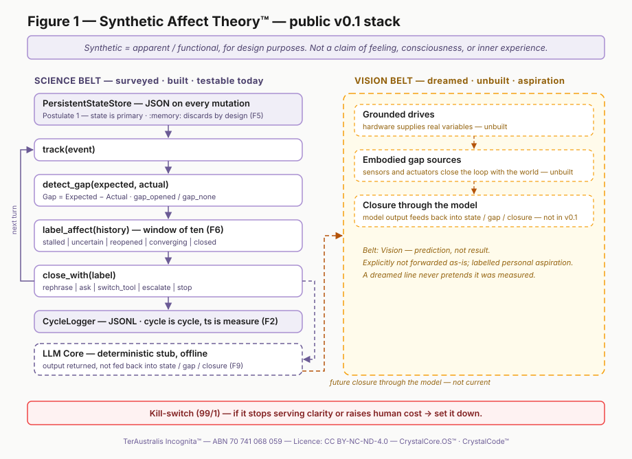

# Figure 1 — Synthetic Affect Theory Stack

Ported from CrystalCore.OS/synthetic-affect (2026-08-14).

**Caption.** Figure 1: Synthetic Affect Theory Stack. Implementation:
CrystalCore.OS™️ · Language: CrystalCode™️ · TerAustralis Incognita™️. Software
simulation (left) grounds in hardware regulation (right). Functional / simulated
affect only.

## Left column — Software Today. Belt: Science.

Every box maps to a module you can run.

| Box | Module | Note |
|---|---|---|
| Persistent State Store | `core/state.py` | JSON-backed; survives reopening |
| Affect Model | `core/affect.py` | classifier, five labels, windowed (F6) |
| Gap Detector | `core/gap.py` | `Gap = Expected − Actual` |
| Closure Policy | `core/closure.py` | selects the move; never grades itself |
| LLM Core | `core/loop.py` | **v0.1: deterministic offline stub, no model** |

The arrow from LLM Core back to the state store is the loop closing. In v0.1 the
stub's output does not yet feed the next gap — the cycle is driven by the caller
supplying the next `actual`. The arrow is drawn because it is the architecture;
the stub label is on the box so the drawing does not overclaim.

## Right column — Hardware Future. Belt: Vision, unbuilt.

No sensors, no homeostatic loops, no edge compute, no actuators exist in this
repository. The column states the argument that modelled gaps become grounded
drives once real physical variables are being regulated. Until hardware produces
evidence, it stays labelled as vision.

## Editing

`figure-1.svg` is hand-authored, self-contained, and has no external font or
image dependency. If you change box geometry, keep every element inside the
`viewBox` — an earlier version placed two boxes below a 400-unit viewBox and they
were silently clipped in every renderer.

---

**All rights reserved.** TerAustralis Incognita™️ — ABN 70 741 068 059
