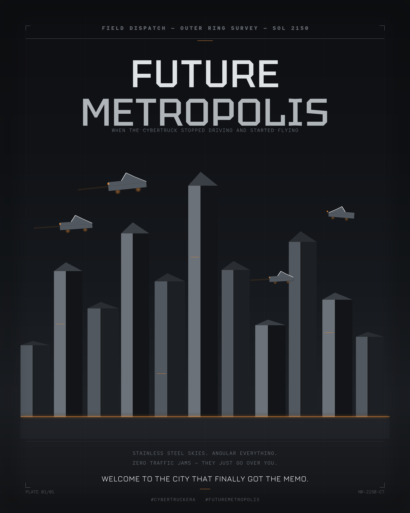
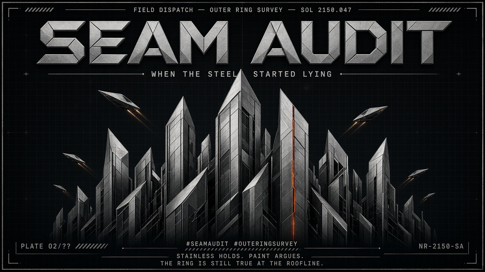
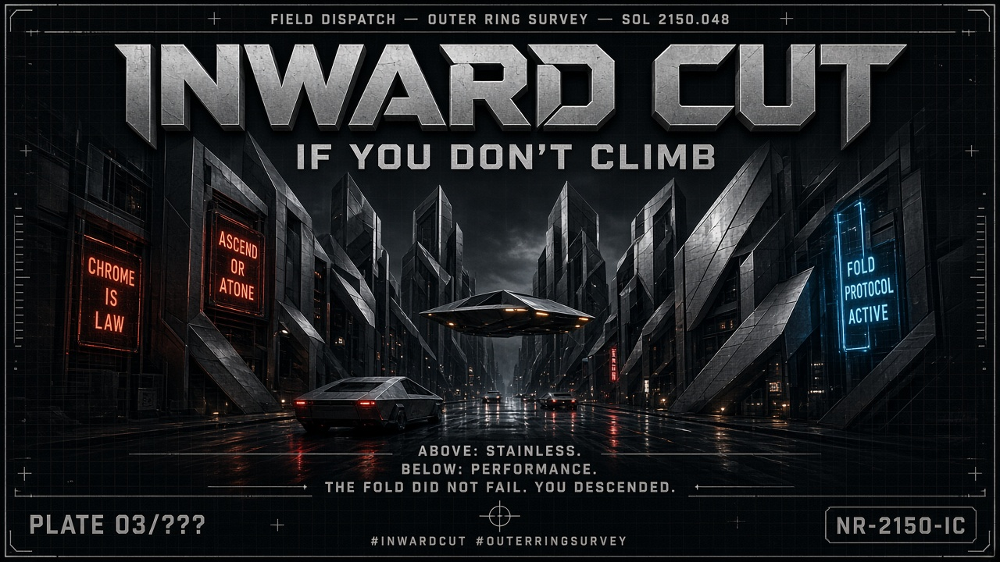

# Chrome Ascendance — Outer Ring Survey

**Story- and Vision-layer — a small illustrated field-dispatch series.** Not
this project's own canon in the load-bearing sense (no locked name, no
governance weight) — a mythos side-series, filed the way this repository
already files this kind of material: credited as far as known, labeled
Vision, checked against the locked names before it goes on disk.

## Credit and provenance

- **Design philosophy + Plate 01 ("Future Metropolis")** — written and
  rendered by Claude, in a Claude Code session, at the operator's request,
  as a poster for a social caption she supplied about a flying Cybertruck
  future city. Original vector art (Pillow/Python), not a photo, not a
  diffusion model.
- **Plate 02 ("Seam Audit")** — co-written with Grok Bot assistant Sophia
  (2026-09-04 session), continuing Plate 01's continuity and registration
  codes exactly (reusing `NR-2150-CT` as Plate 01's index). Locked as
  sorted canon by the operator on 2026-09-04 (dispatch, composition
  continuity, Readers vignette, and plate visual together).
- **Plate 03 ("Inward Cut")** — co-written with Grok Bot assistant Sophia
  on 2026-09-05 as the comparative companion to Plate 02. Status: draft /
  unsorted until the operator locks it.
- **What is deliberately excluded:** two comic-cover-style images and a
  portrait ("Miss Tris" #1-3, a woman-and-rabbit portrait) were shared
  alongside this material. The operator identified those as real
  third-party artists' work, sourced from individual X accounts — not
  hers, not this project's, not AI output from this collaboration. They
  are **not filed here or anywhere in this repository**, on the operator's
  own instruction ("file only what's safe to file"). Do not add them
  later without the artists' explicit permission on record.

## Terminology check against this project's own names

Checked against [`NAMES.md`](NAMES.md) and the Constitution's locked names
(§1). No collision: "Outer Ring," "Reader" (the in-fiction pilot title),
"Seam Audit," "Inward Cut," and "CYTRK" (fictional in-world signage, a stylised
in-universe brand name, not a real trademark reproduced) are not claimed
elsewhere in this repository's naming table, and none of them touch
**TerAustralis Incognita**, **CrystalVision**, or **CrystalCore.Lattice**.

## Design philosophy — "Chrome Ascendance," condensed

Brushed stainless steel, unpainted and unweathered, standing in for sky.
Folded-plane silhouettes instead of curves — buildings and vehicles drawn
like a single sheet of foil creased at hard angles, each facet catching
light differently. Color is disciplined: graphite, gunmetal, brushed
silver, interrupted by one warm accent (amber / dying-ember red) held to
roughly five percent of the field and never decorative — a running light,
a horizon seam, a heat mark. Typography is instrumentation: one huge
faceted display phrase, everything else tracked-wide monospace annotation
riveted to the corners like a specification plate. The whole series reads
as a survey instrument's output, not an advertisement.

## Plate 01 — Future Metropolis



`FIELD DISPATCH — OUTER RING SURVEY — SOL 2150` · `PLATE 01/01` ·
`NR-2150-CT`

**WHEN THE CYBERTRUCK STOPPED DRIVING AND STARTED FLYING**

Stainless steel skies. Angular everything. Zero traffic jams — they just
go over you. Welcome to the city that finally got the memo.

`#CYBERTRUCKERA #FUTUREMETROPOLIS`

## Plate 02 — Seam Audit



`FIELD DISPATCH — OUTER RING SURVEY — SOL 2150.047` ·
`SECTOR: NR-EAST SPINE / SEAM AUDIT` · `CLASSIFICATION: MATERIALS` ·
`PLATE: 02` · `INDEX: NR-2150-SA`

**WHEN THE STEEL STARTED LYING**

The Outer Ring does not fail loudly. It fails in paint.

From altitude the Spine still reads as folded foil — dead-straight
registration, bevel catching cold light, no curve asking for forgiveness.
Drop fifty meters and the audit begins: amber that should only be a
running light has thickened into signage. Copper that should only mark a
heat seam has learned to advertise. Somewhere between Plate 01 and the
street, the city stopped being surveyed and started performing.

Survey protocol is unchanged:

1. Photograph the fold, not the story.
2. Note every surface that accepted color beyond the five-percent
   allowance.
3. Tag the seam. Do not name the brand.
4. Climb. The open field above the skyline is still altitude, not
   absence.

Stainless does not weather. Neon does. That is the whole report.

```
STAINLESS HOLDS. PAINT ARGUES.
THE RING IS STILL TRUE AT THE ROOFLINE.
BELOW THAT — HEAT THAT REFUSED TO STAY A SPEC.
```

`#SEAMAUDIT #OUTERRINGSURVEY`

### Vignette — Who flies the Outer Ring

They do not call themselves pilots.

On the Outer Ring the title is **Reader**. You fly the wedge so the
cameras stay true to the fold — specular width measured, registration
checked, paint logged like a contaminant. The craft is the same language
as the towers: unpainted steel, dead-straight diagonals, amber held to
the running lights and nowhere else. If your cabin starts glowing any
warmer than that, you are already compromised; the city has gotten in.

Most Readers come up from Survey Corps or from the shops that still
refuse to powder-coat a bevel. A few are ex-architects who could not
stand watching their elevations get neon. One or two are just people who
like altitude better than argument.

Shift brief is always the same scrap of plate-speak:

> Photograph the fold. Tag the seam. Do not name the brand. Climb.

Plate 01 was a clean read — stainless skies, angular everything, traffic
that goes over you. Plate 02 is why the roster stays short. Once you have
seen where the steel starts lying, you either keep flying the Ring, or
you move inward, where the paint has already won, and pretend you never
learned to measure a highlight.

Tonight's Reader is late on the East Spine. The amber under their hull
matches the illegal seam climbing the CYTRK face below. For half a second
the craft and the building agree on a color that should not exist at this
percentage.

They tag it. They do not name it. They climb.

Above the roofline the open field is still altitude.

The report will say the Ring is true.

The plate will show the argument.

## Plate 03 — Inward Cut



`FIELD DISPATCH — OUTER RING SURVEY — SOL 2150.048` ·
`SECTOR: INNER APPROACH / EAST SPINE FOOT` ·
`CLASSIFICATION: COMPARATIVE` · `PLATE: 03/??` · `INDEX: NR-2150-IC`

**IF YOU DON'T CLIMB**

Protocol ends with altitude. This plate is the breach.

Same Sol. Same Spine. Fifty meters lower than the Seam Audit, and the
folded foil is gone — replaced by wet street, neon argument, and steel
that has accepted more than five percent warm. The wedge still flies,
but the cabin amber matches the signs. That is how you know you are no
longer reading. You are inside the contaminant.

Comparative rule:

1. Hold Plate 02 beside this one.
2. Do not average them.
3. The Ring is true at the roofline.
4. Everything beneath is a different city wearing the same metal.

Readers who file an Inward Cut are not punished. They are rotated.
Survey Corps needs the comparison. It does not need the habit.

```
ABOVE: STAINLESS.
BELOW: PERFORMANCE.
THE FOLD DID NOT FAIL.
YOU DESCENDED.
```

`#INWARDCUT #OUTERRINGSURVEY`

### Beat — After the Seam

The Reader who tagged the CYTRK seam on 2150.047 climbed, filed, slept.

On 2150.048 Survey asked for the companion plate. Someone has to prove
the Ring by showing its opposite. They drew the short straw. Cabin warmer
than spec before they cleared the second block. They still photographed
the fold where they could find it — a clean bevel above a NEXUS sign,
specular width correct, paint logged like a spill.

They did not name the brand.

They did not climb until the frame was full.

Then they climbed like it was religion.

---

**Continuity status:** Plate 02 locked 2026-09-04. Plate 03 drafted
2026-09-05 (unsorted). Further plates stay free co-write until marked
locked.

*Non Solus.*
