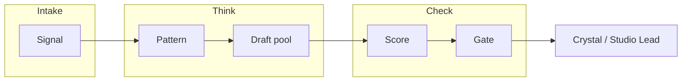

# Bot structure (Crystal hub)

**Canon:** **no**  
**Drawer:** 08_SHARED_CROSS_PROJECT  
**Updated:** 2026-09-18  
**Rule:** Connection ≠ merge. Design map only until Crystal stamps and a real build lands in its own repo.

This is the **one** hub map for bots. Do not invent a second tree. Living code stays in satellite repos (Discord / Clementine / CrystalCore / swarm). Secrets stay in Cursor Secrets / drawer 09 — never in git.

---

## 0. Crystal protocol (every bot)

| Rule | Meaning for bots |
| --- | --- |
| Crystal is authority | AI/bot is a tool. Silence ≠ permission |
| Canon = Crystal stamp | Bot output is not Canon |
| Label science / story / vision | Every public-facing draft carries a layer tag |
| No false bonds | Never claim Elon/xAI ordered, married, or endorsed this |
| No ultimatums to public figures | Drafts that pressure replies → Gate kill |
| Human publishes | No auto-post to X / Discord / email as default |
| Official APIs only | No ToS-breaking scrapers |
| Path-4 audit | Risk + factual criteria before anything leaves Stage 6 |

Paste card for any model: [`PASTE-THIS.md`](PASTE-THIS.md) + [`../memory/CORE.md`](../memory/CORE.md).

---

## 1. Layers (not 4,200 bots)

Use **pools**, not a headcount.



| Pool | Role | Model example | Parallelism |
| --- | --- | --- | --- |
| **Intake** | Official API pulls → normalized records | none / light script | 1 scheduler |
| **Pattern** | Formats/hooks over a window | 1× grok / LLM batch | 1 call per window |
| **Draft** | Variants from patterns | grok-4.6 (`XAI_API_KEY`) | N small (3–10) |
| **Score** | Rubric scores + evidence | 1× LLM or rules | 1 pass |
| **Gate** | Hard kill Risk/Factual fails | rules + Crystal protocol | automatic |
| **Human** | Edit / approve / publish | you | 1 |

Detail design (already in archive): `archive/*/GROK-BOT-ARCHITECTURE.md` — Stages 1–6 + Studio Lead. **This file is the hub index;** that doc is the pipeline spec.

---

## 2. Bot roster (named roles)

Each role = one config (prompt + tools + secrets + home repo). Not a swarm of clones.  
Machine-readable twin: [`bots/registry.yaml`](bots/registry.yaml).

| ID | Status | Role | Home (pointer) | Allowed to | Forbidden |
| --- | --- | --- | --- | --- | --- |
| **BOT-GROK** | design | Draft / reason via xAI | Cursor agent + `XAI_API_KEY` | Drafts, audits, briefs | Auto-post; false Elon claims |
| **BOT-DISCORD** | dormant | Companion / channel reply | `archive/discord-ai-agent/`, Clementine | Replies in allowed guilds | Scrape; claim Canon |
| **BOT-COLLECT** | design | Collection Mode ingest | Drive staging + hub extracts | File extracts to drawers | Chat dumps into Canon |
| **BOT-RESEARCH** | design | Science drawer agents | drawers 16–20 satellites | Experiments in own repos | Merge forks into CVS |
| **BOT-PORTAL** | dormant | Celestial Portal voice / UI | drawer 07 + handoff | Local / staged UI | Commit `.env` |

Status: `design` = map + prompts only · `dormant` = code exists elsewhere, not wired · `active` = Crystal-approved runtime.  
Add a row here **and** in `registry.yaml` when Crystal names a new bot. Do not invent IDs in chat only.

### BOT-GROK cards (ready to paste)

| File | Purpose |
| --- | --- |
| [`bots/grok/prompt.md`](bots/grok/prompt.md) | System prompt + hard rules + output shape |
| [`bots/grok/stages.md`](bots/grok/stages.md) | Stage 1–6 bindings + JSON I/O contracts |

---

## 3. Folder / config layout

**In this hub (design skeletons only):**

```
docs/
  BOT-STRUCTURE.md     # this map
  bots/
    registry.yaml      # id, status, secrets_names, publish_mode: human_only
    grok/
      prompt.md
      stages.md
```

Living runtimes stay in a **dedicated bot repo** (or CrystalCore / Discord / Clementine). Copy or symlink `_protocol/` there from `memory/CORE.md` + `docs/PASTE-THIS.md` + this map. Do not grow executable bot code inside CVS unless Crystal stamps otherwise.

Secrets (Cursor Secrets / env — never commit):

| Name | Used by |
| --- | --- |
| `XAI_API_KEY` | BOT-GROK |
| Discord token(s) | BOT-DISCORD |
| Platform API keys | Intake only |

---

## 4. Gate rubric (Stage 5–6 minimum)

| Criterion | Fail → |
| --- | --- |
| On-brand / protocol | rewrite or kill |
| Factual (checkable) | kill |
| Risk (defamation, impersonation, unverifiable claims about real people) | **hard kill** |
| Elon/xAI bond language | **hard kill** |
| Novelty | demote |
| Format fit | demote |

Output of Gate = shortlist for **Crystal**, not a post.

---

## 5. v0 slice (buildable)

1. One Intake source (official API) **or** manual paste inbox  
2. One Pattern call (Grok)  
3. Three Draft variants (Grok)  
4. Skip images  
5. Score + Gate in one pass  
6. Write shortlist to drawer **14_AI_INTERACTIONS** as an extract (or email Crystal)

No auto-post. Confirm this is what you want before scaling pools.

---

## 6. Index links

| Doc | Path |
| --- | --- |
| This map | `docs/BOT-STRUCTURE.md` |
| Registry | `docs/bots/registry.yaml` |
| BOT-GROK prompt | `docs/bots/grok/prompt.md` |
| BOT-GROK stages | `docs/bots/grok/stages.md` |
| Pipeline design | `archive/discord-ai-agent/GROK-BOT-ARCHITECTURE.md` (and copies under other archives) |
| Protocol CORE | `memory/CORE.md` |
| Paste card | `docs/PASTE-THIS.md` |
| Secrets | Cursor dashboard Secrets — not this repo |

---

<!-- topics: bots, grok, protocol, structure, human-gate -->
