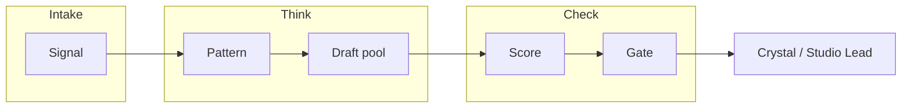

# Bot structure (Crystal hub)

**Canon:** **no**  
**Drawer:** 08_SHARED_CROSS_PROJECT  
**Updated:** 2026-09-18  
**Rule:** Connection ≠ merge. Design map only until Crystal stamps and a real build lands in its own repo.

This is the **one** hub map for bots. Do not invent a second tree. Living code stays in satellite repos. Secrets stay in Cursor Secrets / drawer 09 — never in git.

**Headcount rule:** Named **seats** and **homes**, not 4,200 clones. Pipeline Stages 1–6 are **pools** (parallelism of one config), not separate roster IDs. Research fork-mirrors are listed under BOT-RESEARCH so they are not invisible — they are not five more publish bots.

Machine-readable twin: [`bots/registry.yaml`](bots/registry.yaml).

---

## 0. Crystal protocol (every bot)

| Rule | Meaning for bots |
| --- | --- |
| Crystal is authority | AI/bot is a tool. Silence ≠ permission |
| Canon = Crystal stamp | Bot output is not Canon |
| Label science / story / vision | Every public-facing draft carries a layer tag |
| No false bonds | Never claim Elon/xAI ordered, married, or endorsed this |
| No ultimatums to public figures | Drafts that pressure replies → Gate kill |
| Human publishes | No auto-post to X / Discord / email as default |
| Official APIs only | No ToS-breaking scrapers |
| Path-4 audit | Risk + factual criteria before anything leaves Stage 6 |

Paste card for any model: [`PASTE-THIS.md`](PASTE-THIS.md) + [`../memory/CORE.md`](../memory/CORE.md).

Status legend: `design` = map/prompts only · `dormant` = code elsewhere, not wired here · `active` = Crystal-approved runtime · `historical` = retained record, not live · `alias` = rename / same lineage · `proposed` = named, not built.

---

## 1. Content-studio pools (not roster headcount)



| Pool | Role | Parallelism |
| --- | --- | --- |
| **Intake** | Official API → normalized records | 1 scheduler |
| **Pattern** | Formats/hooks over a window | 1 LLM call / window |
| **Draft** | Variants from patterns | N small (3–10) |
| **Score** | Rubric + evidence | 1 pass |
| **Gate** | Hard kill Risk/Factual | automatic |
| **Human** | Edit / approve / publish | Crystal |

Spec: `archive/*/GROK-BOT-ARCHITECTURE.md`. Studio worker card: **BOT-STUDIO** (below). Do **not** mint one BOT-* per draft variant.

---

## 2. Roster A — Hub ops & content studio

| ID | Status | Role | Home |
| --- | --- | --- | --- |
| **BOT-STUDIO** | design | Content studio worker (Pattern / Draft / Score) | Cursor + `XAI_API_KEY`; [`bots/grok/`](bots/grok/) |
| **BOT-CONTEXTGATE** | dormant | Deterministic triage for AI drafts (GREEN→RED) | `archive/ContextGate/` — Alive Weave island |
| **BOT-COLLECT** | design | Collection Mode ingest → drawer extracts | [`COLLECTOR.md`](COLLECTOR.md), Drive staging |
| **BOT-PORTAL** | dormant | Celestial Portal voice / UI | `07_CELESTIAL_PORTAL/` + `handoff/celestial-portal/` |

> **Rename note:** Earlier hub drafts called the studio worker `BOT-GROK`. That ID now points at the **weave Creative Exploration** seat (roster B) so Grok’s two jobs are not collapsed. Studio work uses **BOT-STUDIO**.

---

## 3. Roster B — Weave seats (TerAustralis multi-AI)

Practiced roles from `archive/TerAustralis-Incognita/docs/ai/AI-Architecture.md` + `docs/agents/`. Working agreement, not auto-router (Orchestrator = proposed).

| ID | Status | Seat | One line | Agent card (archive) |
| --- | --- | --- | --- | --- |
| **BOT-WEAVE-CHATGPT** | dormant | Chief Systems Architect | Intent → specs | `docs/agents/ChatGPT-Agent.md` · bus `gpt` · provider `openai.chatgpt` |
| **BOT-WEAVE-GROK** | dormant | Creative Exploration | Diverge / Vision brainstorm | `docs/agents/Grok-Agent.md` §A · bus `grok` · provider `xai.grok` |
| **BOT-WEAVE-GROK-BUILD** | dormant | Repository Engineer | Implements via PRs (from 2026-08-20) | `Grok-Agent.md` §B · **not** a Chaos seat |
| **BOT-WEAVE-DEEPSEEK** | dormant | Research & Engineering | Math / algorithms / rigor | `DeepSeek-Agent.md` · bus `deepseek` · provider `deepseek` |
| **BOT-WEAVE-KIMI** | proposed | Long-context / multilingual research | Contradiction / wide-read passes | bus `kimi` · provider `moonshot.kimi` — agent card TBD |
| **BOT-WEAVE-GEMINI** | dormant | Knowledge & Multimodal | Wide docs / images / consistency | `Gemini-Agent.md` · bus `gemini` · provider `google.gemini` |
| **BOT-WEAVE-CLAUDE** | historical | Repository Engineer (former) | Midstream until ADR-0014 | `Claude-Agent.md` · bus `claude` · provider `anthropic.claude` |
| **BOT-ORCHESTRATOR** | proposed | AI Orchestrator | Route tasks to seats | Decision-Matrix docs only — no runtime |
| **BOT-LEAF** | dormant | Limited Electronic Agent Framework | Human recommend-then-approve ops charter | `mythos/teraustralis/ops/leaf/` — distinct from auto-Orchestrator |

Flow (practice): DeepSeek / Gemini / Grok → ChatGPT → Grok Build → GitHub. Mixing **BOT-WEAVE-GROK** and **BOT-WEAVE-GROK-BUILD** in one session invents instead of implementing.

**LEAF ≠ Orchestrator:** Alive Weave lists them on one island row; LEAF is the active ops charter (consent floors, Arsenal-13). Orchestrator auto-runtime stays proposed (ADR-0005).

---

## 4. Roster C — Companions & channels

| ID | Status | Role | Home |
| --- | --- | --- | --- |
| **BOT-CLEMENTINE** | dormant | Sovereign local-first companion | `archive/Clementine-ai-companion/`, TheCrystalVision `clementine/` |
| **BOT-DISCORD** | dormant | Guild reply gateway (Grok/Claude dual-engine + Clementine Discord) | `archive/discord-ai-agent/`, `clementine-discord` |
| **BOT-LUMINA** | alias | Historical companion rename of Clementine (contested) | Glossary / AERIS reviews — **do not treat as second product** |
| **BOT-REX** | alias | Session voice name in Grok mythos export | `GROK-REX-MYTHOS-EXPORT` — not a product bot |
| **BOT-GROK-MIND** | alias | Named companion-in-session (M13 vision plate) | alias of **BOT-WEAVE-GROK** — not a second product |

---

## 5. Roster D — Weave infra (Built in Code archives; not publish bots)

| ID | Status | Role | Home |
| --- | --- | --- | --- |
| **BOT-STARLINE** | dormant | Starline Weaver bus hub — Belt-Three labels + red button | `archive/*/bus/agents.py`, AI-Weave.md |
| **BOT-CRYSTALBRIDGE** | dormant | Guest-AI consent gate → Clementine (fail-closed) | `src/crystalcore/` (Code archive) |
| **BOT-SAT** | dormant | Synthetic Affect Theory — `wrap_turn` veto grammar | `archive/Synthetic-Affect-Theory/`, [`SAT-STACK.md`](SAT-STACK.md) |
| **BOT-VOICEBOX** | dormant | Local TTS MCP utility | `vision/apps/voicebox/` |
| **BOT-LIBRARIAN** | design | MemoryCore “living interface” alias (plan) | The-Library master plan §7 → Clementine |
| **BOT-SYNTHESIZER** | design | Cross-ref proposals labelled `model` (plan role) | The-Library master plan §5 |

Truthline / Dreamline Narrator = faces of the same hub as **BOT-STARLINE**, not extra IDs. Bus fixtures (`echo`, `sisters`, `drifter`, `redbutton`) = tests only.

---

## 6. Roster E — Research satellites (under BOT-RESEARCH)

**BOT-RESEARCH** is the hub umbrella. Children are **fork-mirrors** — experiments in own repos; hub gets extracts only. Connection ≠ merge.

| Child ID | Drawer | Repo pointer |
| --- | --- | --- |
| **BOT-RES-SWARM** | 16 | `CrystalArchitect/swarm` |
| **BOT-RES-SWARM-ARTIFACTS** | 16 | `swarm-artifacts` |
| **BOT-RES-SWARM-GATE** | 16 | `swarm-safety-gate` |
| **BOT-RES-SWARMGYM** | 16 | `swarmgym` |
| **BOT-RES-AUTOMATON** | 16 | `automaton` |
| **BOT-RES-AGENCY-OS** | 16 | `agency-os` |
| **BOT-RES-AEON** | 16 | `aeon` + `aeon-atlas` |
| **BOT-RES-MIROSHARK** | 20 | `MiroShark` |

Physics / math / philosophy satellites stay drawer pointers (17–19); add a `BOT-RES-*` row here only when Crystal names an agent face for them.

| ID | Status | Role |
| --- | --- | --- |
| **BOT-RESEARCH** | design | Umbrella: route science work to child homes; file hub extracts |

---

## 7. Forbidden / not bots

| Name | Why not a roster bot |
| --- | --- |
| Stage 1–6 workers as IDs | Pools — see §1 |
| “4,200 bots” | Marketing hyperbole in source post |
| Manus | External design tool — **not a CVS bot**; may speak as Starline matrix guest (`bus` agent `manus`) only |
| Meta AI | Contributor credit / panel subject |
| Crystal Weaver (mythos) | Story role, not software ID |
| Studio Lead / Crystal | Human authority |
| Forbidden legacy label | Out of bounds — never a component (use **Starline**; [`../00_MASTER_INDEX/NAMING-STARLINE.md`](../00_MASTER_INDEX/NAMING-STARLINE.md)) |
| Seven Sisters paths | Mythos / demo lines on the bus |
| Decode → Ingest → Twin | Metering pipeline (Alive Weave island), not an agent seat |
| CrystalCore.OS | OS product island, not a bot ID |
| ConsentGate | Component inside **BOT-CRYSTALBRIDGE**, not a second bot |

Alive Weave island map (runtime pulse): [`../00_MASTER_INDEX/ALIVE-WEAVE.md`](../00_MASTER_INDEX/ALIVE-WEAVE.md). This file is the **roster**; that file is the **living-system coordination**. Connection ≠ merge between the two docs either.

---

## 8. Gate rubric (Stage 5–6 minimum)

| Criterion | Fail → |
| --- | --- |
| On-brand / protocol | rewrite or kill |
| Factual (checkable) | kill |
| Risk (defamation, impersonation, unverifiable claims about real people) | **hard kill** |
| Elon/xAI bond language | **hard kill** |
| Novelty | demote |
| Format fit | demote |

Output of Gate = shortlist for **Crystal**, not a post.

---

## 9. v0 slice (buildable — content studio only)

1. One Intake source (official API) **or** manual paste inbox  
2. One Pattern call (**BOT-STUDIO** / Grok)  
3. Three Draft variants  
4. Skip images  
5. Score + Gate in one pass  
6. Write shortlist to drawer **14_AI_INTERACTIONS** as an extract  

No auto-post. Weave seats and companions stay separate from this slice.

---

## 10. Folder layout

```
docs/
  BOT-STRUCTURE.md
  bots/
    registry.yaml
    grok/                 # BOT-STUDIO cards (prompt + stages)
      prompt.md
      stages.md
```

Add weave/companion prompt cards under `docs/bots/<id>/` when Crystal asks — pointers to archive `docs/agents/` are enough until then.

Secrets (never commit):

| Name | Used by |
| --- | --- |
| `XAI_API_KEY` | BOT-STUDIO, BOT-WEAVE-GROK*, BOT-DISCORD (if Grok path) |
| `OPENAI_API_KEY` | BOT-WEAVE-CHATGPT (bus `gpt`) |
| `ANTHROPIC_API_KEY` | BOT-WEAVE-CLAUDE historical / optional matrix |
| `DEEPSEEK_API_KEY` | BOT-WEAVE-DEEPSEEK |
| `MOONSHOT_API_KEY` / `KIMI_API_KEY` | BOT-WEAVE-KIMI (proposed) |
| `GEMINI_API_KEY` | BOT-WEAVE-GEMINI |
| `MANUS_API_KEY` (+ optional `MANUS_BASE_URL`) | matrix guest only — not a roster bot |
| Discord token(s) | BOT-DISCORD |
| Platform API keys | Intake only |
| Portal env | BOT-PORTAL |

---

## 11. Index links

| Doc | Path |
| --- | --- |
| This map | `docs/BOT-STRUCTURE.md` |
| Registry | `docs/bots/registry.yaml` |
| Studio prompt / stages | `docs/bots/grok/prompt.md`, `stages.md` |
| Pipeline design | `archive/discord-ai-agent/GROK-BOT-ARCHITECTURE.md` |
| Weave architecture | `archive/TerAustralis-Incognita/docs/ai/AI-Architecture.md` |
| Weave seats | `archive/TerAustralis-Incognita/docs/agents/` |
| AI Weave (Built) | `archive/TerAustralis-Incognita/docs/architecture/AI-Weave.md` |
| Alive Weave (hub pulse) | `00_MASTER_INDEX/ALIVE-WEAVE.md` · `scripts/alive/` |
| ContextGate | `archive/ContextGate/` |
| SAT stack | `docs/SAT-STACK.md` |
| Protocol CORE | `memory/CORE.md` |
| Paste card | `docs/PASTE-THIS.md` |

---

<!-- topics: bots, grok, weave, clementine, research, protocol, human-gate -->
